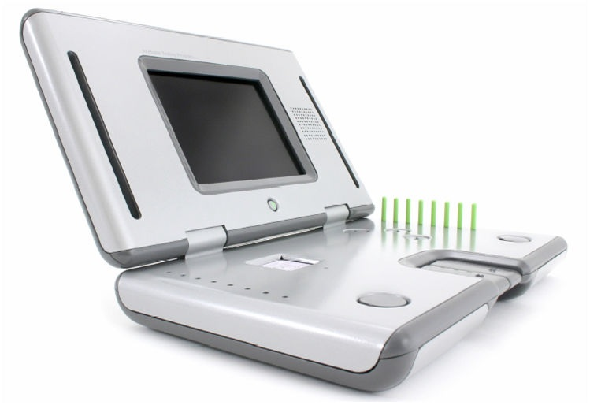

Capstone Project Proposal
================
Katherine Hemzacek  
June 18, 2017

Abstract
--------

This project will create an algorithm that uses signal characteristics of voice recordings to predict Unified Parkinson's Disease Prediction Scale (UPDRS) scores, which are a standard measure of the severity of disability in Parkinson's patients. This could be implemented into the Kinetics Foundation's At Home Testing Device to aid in better disease progression monitoring, especially for remote patients.

[GitHub Repository](https://github.com/khemzacek/Automating-Parkinsons-Assessment)

  
Fig 1: The At Home Testing Device (AHTD)

Problem Setup
-------------

The current gold-standard for monitoring the progression of Parkinson's Disease (PD) is the Unified Parkinson's Disease Rating Scale (UPDRS). To get a UPDRS score, a patient will perform a series of tasks and a trained medical rater will assess the degree of disability shown in the patient. This assessment protocol can be problematic for two reasons: 1) The test must be done in person, which limits how often monitoring can be done, especially for rural patients with a long commute into a medical center. 2) The test is subjective, so tests often require longer and depend on clinical opinion.

The Kinetics Foundation, with the help of Intel, developed an At Home Testing Device (AHTD) to test the feasibility of remote monitoring for PD patients. This device guides patients through a series of tasks and records the results, which are then sent via internet to the patient's physician. The AHTD would allow monitoring measurements to be performed much more frequently, detecting changes more quickly. It would also reduce the travel time required of patients, especially rural patients. The measurements taken by this device could also be analyzed quantitatively, making the measurement of PD progression less subjective and potentially automated.

This project will focus on the automated analysis of voice recordings resulting from a speech task that AHTD users were asked to perform. An algorithm will be developed that uses signal characteristics of these voice recordings to predict a UPDRS score. This algorithm could potentially be implemented into the AHTD or other similar devices to better automate all PD monitoring and to increase the feasibility of implementing widespread AHTD usage by reducing the time required of physicians to interpret results.

Data
----

This project will use the Oxford Parkinson's Disease Telemonitoring Dataset, available [here](https://archive.ics.uci.edu/ml/datasets/parkinsons+telemonitoring). It was donated to the UCI Machine Learning Repository on 2009-10-29 by Athanasios Tsanas and Max Little of the University of Oxford.

The voice recordings were obtained as part of a feasibility study for the AHTD1. A variety of signal processing techniques were then applied to each recording to calculate the signal attributes that are shown in the dataset referenced above2.

The overall dataset includes 22 attributes for 5875 observations.

The observations come from 42 unique people, each taking about 150 recordings over a 6-month period. Once per week, each subject would take six recordings of the same sound (a sustained vowel phonation "ah"). Four of the six were done at normal speaking volume and the other two were done at a louder volume.

The attributes include:

-   Subject number
-   Time since trial recruitment
-   2 subject demographics (age, gender)
-   2 UPDRS scores (total, motor)
-   16 signal attributes
    -   5 measures of variation in fundamental frequency (Jitter(%), Jitter(Abs), Jitter:RAP, Jitter:PPQ5, Jitter:DDP)
    -   6 measures of variation in amplitude (Shimmer, Shimmer(dB), Shimmer:APQ3, Shimmer:APQ5, Shimmer:APQ11, Shimmer:DDA)
    -   5 non-linear signal characteristics: NHR (Noise to Harmonics Ratio), HNR (Harmonics to Noise Ratio), RPDE (Recurrence Period Density Entropy), DFA (Detrended Fluctuation Analysis), PPE (Pitch Period Entropy)

The dataset structure is shown below:

    ## 'data.frame':    5875 obs. of  22 variables:
    ##  $ subject.     : int  1 1 1 1 1 1 1 1 1 1 ...
    ##  $ age          : int  72 72 72 72 72 72 72 72 72 72 ...
    ##  $ sex          : int  0 0 0 0 0 0 0 0 0 0 ...
    ##  $ test_time    : num  5.64 12.67 19.68 25.65 33.64 ...
    ##  $ motor_UPDRS  : num  28.2 28.4 28.7 28.9 29.2 ...
    ##  $ total_UPDRS  : num  34.4 34.9 35.4 35.8 36.4 ...
    ##  $ Jitter...    : num  0.00662 0.003 0.00481 0.00528 0.00335 0.00353 0.00422 0.00476 0.00432 0.00496 ...
    ##  $ Jitter.Abs.  : num  3.38e-05 1.68e-05 2.46e-05 2.66e-05 2.01e-05 ...
    ##  $ Jitter.RAP   : num  0.00401 0.00132 0.00205 0.00191 0.00093 0.00119 0.00212 0.00226 0.00156 0.00258 ...
    ##  $ Jitter.PPQ5  : num  0.00317 0.0015 0.00208 0.00264 0.0013 0.00159 0.00221 0.00259 0.00207 0.00253 ...
    ##  $ Jitter.DDP   : num  0.01204 0.00395 0.00616 0.00573 0.00278 ...
    ##  $ Shimmer      : num  0.0256 0.0202 0.0168 0.0231 0.017 ...
    ##  $ Shimmer.dB.  : num  0.23 0.179 0.181 0.327 0.176 0.214 0.445 0.212 0.371 0.31 ...
    ##  $ Shimmer.APQ3 : num  0.01438 0.00994 0.00734 0.01106 0.00679 ...
    ##  $ Shimmer.APQ5 : num  0.01309 0.01072 0.00844 0.01265 0.00929 ...
    ##  $ Shimmer.APQ11: num  0.0166 0.0169 0.0146 0.0196 0.0182 ...
    ##  $ Shimmer.DDA  : num  0.0431 0.0298 0.022 0.0332 0.0204 ...
    ##  $ NHR          : num  0.0143 0.0111 0.0202 0.0278 0.0116 ...
    ##  $ HNR          : num  21.6 27.2 23 24.4 26.1 ...
    ##  $ RPDE         : num  0.419 0.435 0.462 0.487 0.472 ...
    ##  $ DFA          : num  0.548 0.565 0.544 0.578 0.561 ...
    ##  $ PPE          : num  0.16 0.108 0.21 0.333 0.194 ...

The dataset can be downloaded as a csv file [here](https://archive.ics.uci.edu/ml/machine-learning-databases/parkinsons/telemonitoring/parkinsons_updrs.data).

Analysis Approach
-----------------

The biggest challenge in analyzing the data will be addressing the fact that the observations are not truly independent. To address this, the data will first be analyzed as if the observations are independent, then replicate observations will be averaged and subsets of independent observations will be analyzed.

To analyze the observations as if they are independent, correlation between attributes will first be explored. Then a supervised machine learning algorithm will be used to predict UPDRS scores. A clustering algorithm will also be used to see if the observations cluster by a certain variable (such as by patient).

Summary statistics will then be taken for the set of replicate observations for each patient each week. For each signal characteristic, a measure of central tendency and a measure of variability will be calculated. Subsets of independent instances can then be analyzed and a supervised machine learning algorithm will be used to predict UPDRS scores.

Deliverables
------------

The primary deliverables are the code used to execute the analysis described above, and the final code which would automatically predict the UPDRS score.

I will also deliver a paper and slide deck which will communicate the analysis process and the findings. The paper and slide deck will be targeted at a representative of the Kinetics Foundation and will aim to persuade the client to implement the algorithm into the AHTD.

All final deliverables, as well as intermediate deliverables, will be made available on the project's [GitHub Repository](https://github.com/khemzacek/Automating-Parkinsons-Assessment).

References
----------

1.  Goetz, C.G. et al. Testing objective measures of motor impairment in early Parkinson's disease: Feasibility study of an at-home testing device. Movement Disorders (December 11, 2008) doi. 10.1002/mds.22379

2.  Athanasios Tsanas, Max A. Little, Patrick E. McSharry, Lorraine O. Ramig (2009), 'Accurate telemonitoring of Parkinson's disease progression by non-invasive speech tests', IEEE Transactions on Biomedical Engineering.
