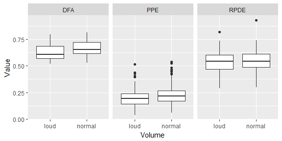
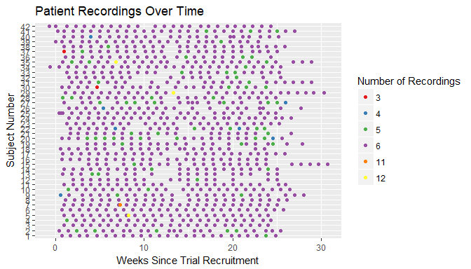
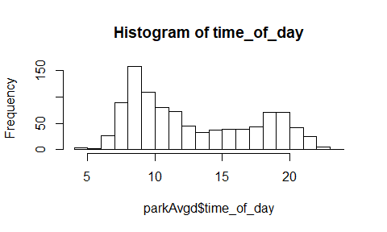
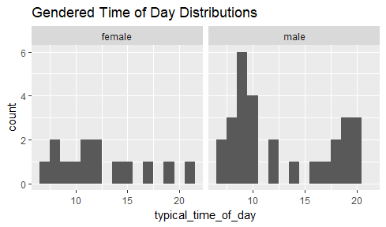
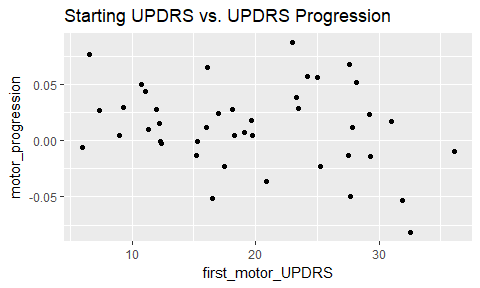
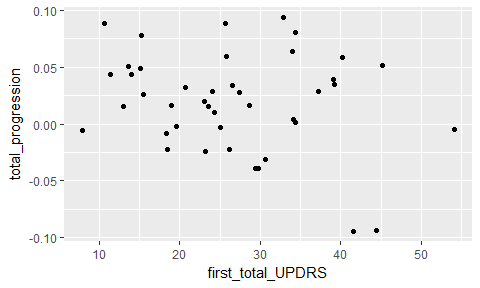

Exploratory Data Analysis Summary
================

Finishing Data Wrangling
------------------------

Before the final averaged dataset could be created, two questions needed to be answered: 1) Should normal and loud recordings be treated as distinct from each other? and 2) Will there be days with other than the expected 6 recordings that will cause problems when averaging?

### Investigating Volume Levels

The first question addressed in exploratory data analysis was whether or not the two volume levels should be considered distinct from each other.

The volume levels were first investigated using unsupervised clustering algorithms to see if data would cluster by volume (or some other variable). Before clustering the data, a within-groups-sum-of-squares plot and a dendrogram were used to try to determine the best number of clusters. Neither clearly indicated one best number of groups. Two group clustering was chosen since this seemed most likely to reveal if the data would cluster into the two volume levels. The clustering data was limited to only signal characteristics. Both hierarchical clustering and k-means clustering were applied to the data. Neither method separated the data into groups defined by volume levels or any other single variable (gender, UPDRS, etc.). While this seemed to indicate no significant difference between the signals at the two volumes, there could have simply been too many factors influencing the clustering. It was decided that more directed investigation was needed.

The volume levels were next investigated with two types of plots: the value of each signal characteristic plotted over time for each patient (with points for each volume level in a different color), and a box plot for each signal characteristic (one box for each volume level). Examples of each type of plot are shown below. While neither type of plot showed huge differences between the two volume levels, they both showed a trend that "normal" volume recordings were higher in most characteristics than "loud" volume recordings were. The plots shown below show this trend most significantly, but the trend was present for all signal characteristics plotted.

Most of the signal characteristics are measures of variation or inconsistency within a signal that should be fairly constant. Increased variation most likely represents increased disability with regard to voice control. The fact that most measures are higher for normal volume recordings seems to suggest that lack of voice control is more evident when a person is speaking normally; speaking loudly may somewhat mask this disability.

The same trend was observed consistently enough across patients and variables, it was decided that normal and loud recordings would be treated as distinct from each other and would not be averaged together.

### Recordings per Patient per Day

After deciding to separate recordings by volume level, it was important to investigate the number of recordings taken by a patient on each given day. If the expected 6 recordings were not present for a given day, there was a chance that this would lead to missing data after the replicate data was averaged.

The scatter plot shows the distribution of test days over time for each patient. The number of recordings taken each day is shown in the color of the points. Many patients have gaps where they didn't take any recordings for at least a week. But because this project doesn't seek to investigate the time-series nature of the data, this shouldn't be a problem. This plot also shows that on the vast majority of days where patients took any recordings, they took the expected 6 recordings. However, there are also a fair number of days when patients only took 5 recordings, and a few exceptions where patients took 3, 4, 11, or 12 recordings. The days with other than 6 recordings seem to be randomly spread across time and patients.

The days with 3 or 4 recordings were investigated to see if both normal and loud recordings were taken. One of the days with 3 was found to be an outlier in the normal/loud signal characteristic time-series plots. On this day, most likely the machine was not working correctly, which explains the outlying data and the fact that the person stopped short of the 6 recordings. This day was removed. Of the seven days with 4 recordings, 2 were found to have no loud recordings, which would result in missing data when these days were averaged. These points were kept and used as partial observations for all exploratory analysis. The rest of the days had at least one loud and one normal recording.

The days with 11 or 12 recordings were investigated to see if these should be treated as two separate sets of recordings. On most of these days, the recordings were taken without much time in between the first set of recordings and the second set, suggesting that the second set was intended as a "re-do" to make up for a real or imagined issue in the first set. One of these days had 11 hours in between. This was more likely intended as two separate sets/data points, but it is difficult to know what was intended. Perhaps 11 hours later was the earliest this person could re-do their trial, given their schedule. While 11 hours more time between sets than the other days with 11 or 12 recordings, it is not very long in comparison to a week, which is the amount of time that was supposed to be in between sets of recordings. Therefore, it was decided that on all days, regardless of the number of recordings taken, all recordings would be averaged to make one observation.

Any days with less than two loud recordings also resulted in missing data in the averaged data set. Both median and IQR were calculated for normal and loud recordings on each day. Median could be calculated wherever there was at least one recording, but IQR could only be calculated if there were at least two recordings. Therefore, there are a total of 25 observations with some missing values. All missing values were coded as NA and the partial observations were kept and used for exploratory data analysis. The MICE algorithm will likely be used to impute the missing values if the missing data becomes an issue.

Data Exploration
----------------

After the final averaged dataset was created, the true exploratory data analysis could begin. The distributions of variables and the correlations between them could be explored.

### "time\_of\_day" Variable

Before further exploration was done, the "time\_of\_day" variable was investigated to determine if it was a broadly meaningful variable (corresponded to a time of day consistently for all patients) or if it only served to order the recordings taken within a day.

The "time\_of\_day" feature was calculated from the given variable "test\_time". The documentation indicated that the integer part of "test\_time" was the number of days since trial recruitment. The non-integer part was not specifically addressed, though it presumably corresponded to the time of day: the hours/minutes/seconds that had passed since the last whole day from trial recruitment. However, it was unclear whether each whole day started at midnight or whether it started at the exact time of day when the patient officially started the trial.

To answer this question, a histogram of "time\_of\_day" was created. If the variable was meaningful, a peak in the morning (before people left for their daily activities), a peak in the evening (after people had finished their daily activities), and possibly a peak around lunchtime were expected, along with a significant lack of data from times in the middle of the night when people were likely sleeping. If the variable did not consistently refer to same times of the day, a more uniform distribution was expected. The histogram is shown below.

The histogram shows no data 0-4 (midnight - 4am) and very little data 4-6 (4am - 6am) and 23-24 (11pm - midnight). There is a peak 8-9 (8am - 9am) and 18-20 (6pm - 8pm) with less data (but not no data) taken between these peaks. Since these peaks correspond to times of day when most recordings were expected and the valleys correspond to times of day when less recordings were expected, it was concluded that the "time\_of\_day" variable is most likely a meaningful indicator of the time of day.

### Patient Data

A dataset of given and calculated characteristics of each patient was created. It included age, gender, length of time in the study, recordings taken, average time between sets of recordings, typical time of day that recordings were taken and the variation in when recordings were taken, starting and ending UPDRS scores, and a calculated feature "progression" which was the overall change in UPDRS divided by the amount of time over which this change took place. While many of these variables did not correlate meaningfully, this exploration did lead to several interesting findings.

First, it was found that the distribution of the time of day that recordings were taken had a different shape for men and women.

The female participants primarily took recordings in the morning and less female participants typically took recordings later in the day. Male participants have two distinct peaks: one in the morning and one in the evening.

Also, with increasing age, participants had, on average, less days between tests and less variability in the time of day when they took their recordings. As the older patients in the study are very likely retired, these correlations may be due to participants having less daily commitments to work around when performing the trials.

Perhaps the most interesting correlation observed was the negative correlation between starting UPDRS and UPDRS progression. The correlation coefficient of the first day motor UPDRS and motor UPDRS progression is -0.2478741 and the correlation coefficient for total UPDRS is -0.2226871. Plotting first day UPDRS vs. UPDRS shows that a negative linear correlation is a decent description of the relationship between the two variables.

This relationship suggests that UPDRS progression over time may be non-linear with significant increase in experienced disability at first and continuing increase over time but at a slower and slower rate. Without more observed data (rather than interpolated UPDRS scores), it is difficult to say if this is truly the case, but this may be a topic worth exploring at another time. As far as it concerns this dataset, it does suggest that the use of linear interpolation to project UPDRS scores between doctor visits may not be appropriate.

### Outcome Variable Distribution

The distribution of UPDRS was investigated to determine if it was normally distributed.

To examine the distribution, a set of independent observations (one random observation from each person) was selected. A Q-Q plot was created for motor UPDRS and total UPDRS for each of 3 selections of independent observations. Each normal Q-Q plot showed a similar trend - the tails are somewhat light, but overall, the data is normally distributed. The light tails actually seem to make sense in the context of the data: UPDRS can't go below 0 making a light tail on the low end, and the trial limited participants to early stage PD patients making a light tail on the high end. Aside from these restrictions, the data distribution is reasonably normal, which means that statistical tests and algorithms which assume normal distribution in the outcome variable can be used on this data.

### Variable Correlations

Finally, the correlations between variables was investigated. Aside from general interest, this step was intended to inform the selection of variables for a linear regression algorithm.

#### Correlation with "motor\_UPDRS"

The correlation coefficients used were calculated within sets of independent observations (one random observation from each person). One hundred different sets of independent observations were randomly selected and the correlation matrices for each set were calculated and stored in a list. The correlation coefficients that describe the correlation of "motor\_UPDRS" with each of the other variables were extracted from each of the 100 correlation matrices and accumulated into a single dataframe. From this dataframe, a box-and-whisker plot was created that showed summary statistics of the correlation coefficients for each variable.

Based on the box plot, seven features were selected that seemed to correlate most significantly with "motor\_UPDRS". The features selected had a median coefficient whose absolute value was 0.2 or greater (or at least close to this), a relatively small IQR, and a range that didn't cross 0. All features not selected had ranges that crossed 0 (could have been positively or negatively correlated with the outcome variable).

The features selected included "age" and six signal characteristics. All signal characteristics were median features, half of them coming from loud recordings and the other half coming from normal-volume recordings. HNR and PPE contributed two signal characteristics (the median of these variables for both loud and normal recordings). Three of the features were non-traditional signal characteristics. Most were positively correlated with motor UPDRS, but the two HNR features were negatively correlated with motor UPDRS.

Twelve other features were identified as having a fair correlation with motor UPDRS. They included "time\_of\_day" and 11 signal characteristics. Again, the characteristics were all medians and a good split of normal and loud features. Most were positively correlated with motor UPDRS, but "time\_of\_day" and "normal\_DFA\_median" were negatively correlated.

It was observed that the correlation coefficients were overall higher when calculated on a subset of independent observations rather than being calculated from all of the observations.

While "time\_of\_day" seems to have a fairly strong correlation with UPDRS, the argument could be made that "time\_of\_day" should not be used as a predictive variable for UPDRS. The variable "time\_of\_day" was calculated from "test\_time", which was used to interpolate UPDRS values. However, since UPDRS generally increases over time, a positive correlation would be expected. There is a negative correlation between "time\_of\_day" and "motor\_UPDRS". Also, "time\_of\_day" only makes up a very small portion of the variation in "test\_time". It was the non-integer part of "test\_time" that became "time\_of\_day". The non-integer part ranged 0-1 whereas all of "test\_time" ranged 0-216. Therefore, "time\_of\_day" was not excluded from predictive models.

#### Correlation Between Top Candidates

After features were selected that had the strongest correlation with "motor\_UPDRS", the correlation between these variables was investigated.

From each item in the list of correlation matrices, a smaller correlation matrix was selected which contained the coefficients that described only the correlations between the top feature candidates. From these matrices, the correlation coefficients relating to a single feature were pulled and aggregated into a dataframe (one for each of the top candidates). From these dataframes, box-and-whisker plots were created to visually inspect the correlation between the candidate features.

Between candidate features, a low correlation coefficient was desired. For each candidate feature, there was at least two other features which have a high correlation with the outcome variable and a low correlation with each other. Each of these sets of variables could make a good selection of predictive variables for a linear regression model. The next step will be implementing a linear regression machine learning algorithm to see if a strong predictive model can be created.

Conclusion
----------

The exploratory data analysis described above informed the last steps of data wrangling so that a dataset could be created where all replicate data was averaged together. It also set up an understanding of the data that will facilitate the next steps of creating a predictive model for UPDRS.
