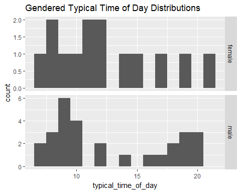
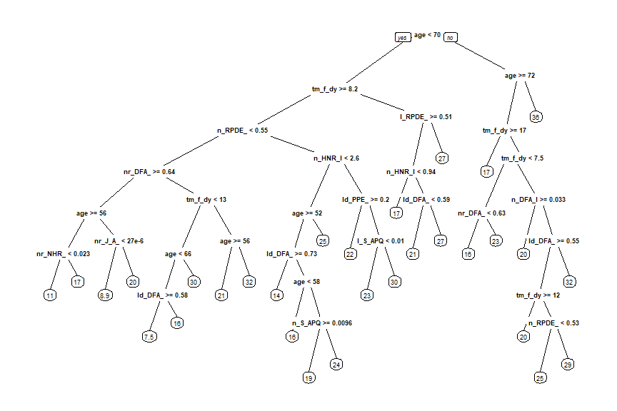
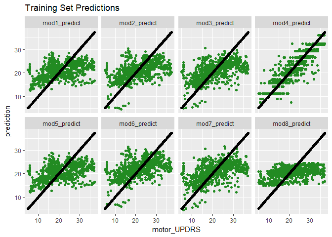
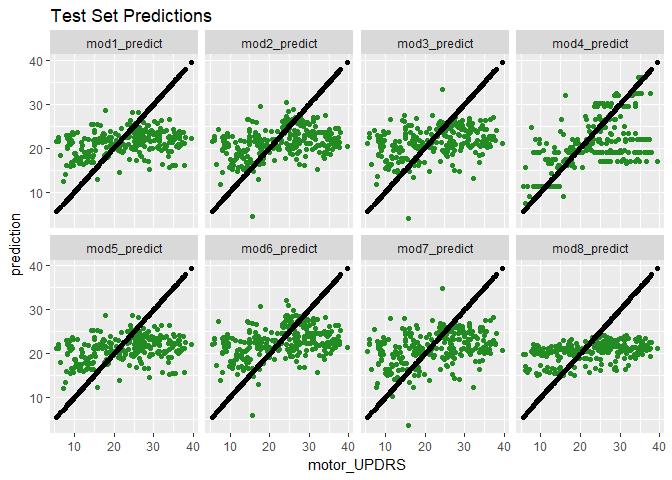
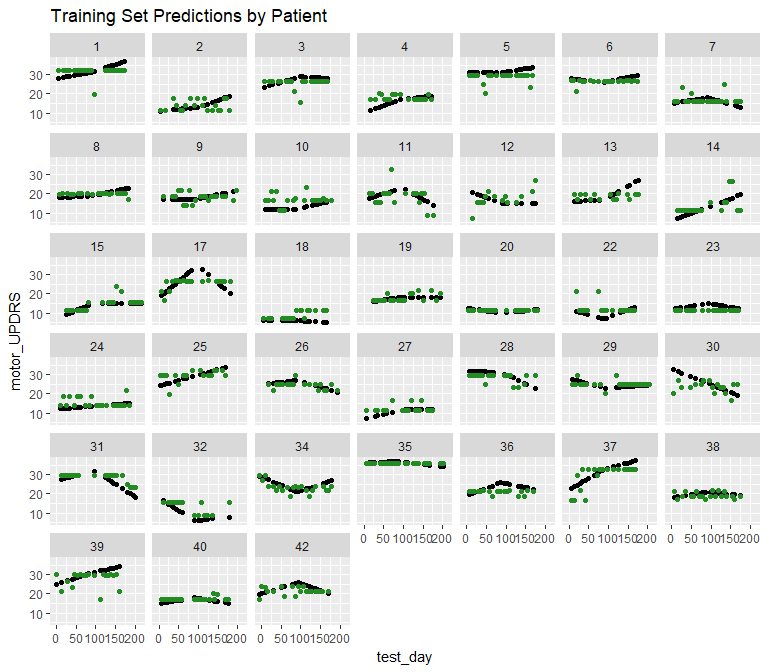
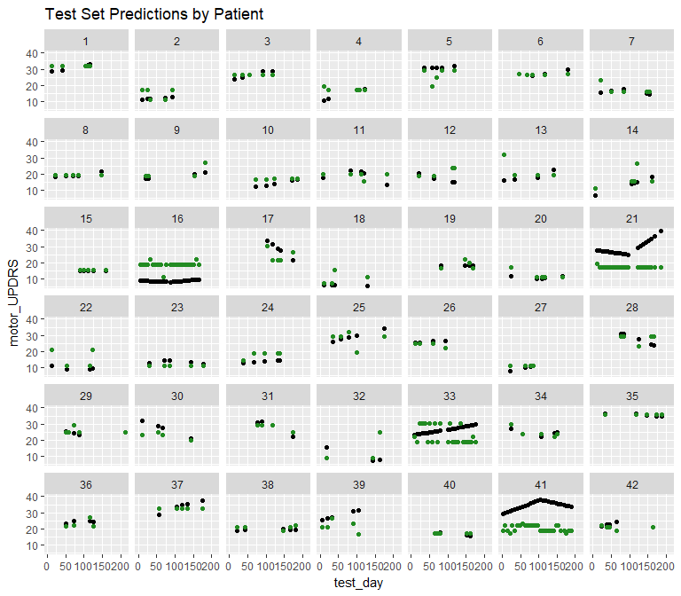

Automating the Monitoring of Parkinson's Disease
================

Abstract
--------

This project will create an algorithm that uses signal characteristics of voice recordings to predict Unified Parkinson's Disease Prediction Scale (UPDRS) scores, which are a standard measure of the severity of disability in Parkinson's patients. This could be implemented into the Kinetics Foundation's At Home Testing Device to aid in better disease progression monitoring, especially for remote patients.

Fig 1: The At Home Testing Device (AHTD)

Problem Setup
-------------

The current gold-standard for monitoring the progression of Parkinson's Disease (PD) is the Unified Parkinson's Disease Rating Scale (UPDRS). To get a UPDRS score, a patient will perform a series of tasks and a trained medical rater will assess the degree of disability shown in the patient. This assessment protocol can be problematic for two reasons: 1) The test must be done in person, which limits how often monitoring can be done, especially for rural patients with a long commute into a medical center. 2) The test is subjective, so tests often require longer and depend on clinical opinion.

The Kinetics Foundation, with the help of Intel, developed an At Home Testing Device (AHTD) to test the feasibility of remote monitoring for PD patients. This device guides patients through a series of tasks and records the results, which are then sent via internet to the patient's physician. The AHTD would allow monitoring measurements to be performed much more frequently, detecting changes more quickly. It would also reduce the travel time required of patients, especially rural patients. The measurements taken by this device could also be analyzed quantitatively, making the measurement of PD progression less subjective and potentially automated.

This project will focus on the automated analysis of voice recordings resulting from a speech task that AHTD users were asked to perform. An algorithm will be developed that uses signal characteristics of these voice recordings to predict a UPDRS score. This algorithm could potentially be implemented into the AHTD or other similar devices to better automate all PD monitoring and to increase the feasibility of implementing widespread AHTD usage by reducing the time required of physicians to interpret results.

Original Dataset
----------------

This project uses the Oxford Parkinson's Disease Telemonitoring Dataset, available [here](https://archive.ics.uci.edu/ml/datasets/parkinsons+telemonitoring). The voice recordings were obtained as part of a feasibility study for the AHTD1. A variety of signal processing techniques were then applied to each recording to calculate the signal attributes that are shown in the dataset2. It was donated to the UCI Machine Learning Repository on 2009-10-29 by Athanasios Tsanas and Max Little of the University of Oxford.

The original dataset includes 5875 observations, each observation representing one voice recording. The observations come from 42 early-stage Parkinson's patients. Once per week, each subject was supposed to take six recordings of the same sound (a sustained vowel phonation "ah"), four recordings at normal speaking volume and the other two at a louder volume. Patients performed this testing over approximately six months.

The 22 given attributes include:

-   Subject number
-   Time since trial recruitment
-   2 subject demographics (age, gender)
-   2 UPDRS scores (total, motor)
-   16 signal attributes
    -   5 measures of variation in fundamental frequency (Jitter variables)
    -   6 measures of variation in amplitude (Shimmer variables)
    -   NHR (Noise to Harmonics Ratio) and HNR (Harmonics to Noise Ratio)
    -   3 non-traditional signal characteristics: RPDE (Recurrence Period Density Entropy), DFA (Detrended Fluctuation Analysis), PPE (Pitch Period Entropy)

### Dataset Challenges and Limitations

First, because each of the observations represents one recording and patients took 2 loud and 4 normal-volume recordings each day, the dataset actually includes a lot of replicate observations. Even if the replicates are averaged together, the dataset still contains many observations from the same person across a particular timeline, so the observations are not truly independent of each other. As many analysis methods assume independent observations, this will need to be addressed. After it is, because there are only 42 people, the set of independent observations will actually be quite small. To address this, analysis may need to be repeated on several randomly selected sets of independent observations and the results averaged together.

The dataset also doesn't include a lot of data aside from the signal attributes and UPDRS scores. The amount of patient data included may need to be limited because of privacy concerns, but it does mean that the signal attributes don't have a lot of clinical context. Also, UPDRS scores are typically based on a person's performance on multiple tasks. An algorithm that can interpret the results of one task is a necessary step, but more data would be required to begin interpreting other tasks and get a better prediction of overall UPDRS.

Lastly, the UPDRS scores in the dataset are actually linear interpolations based on the UPDRS scores at doctors visits at the beginning, middle, and end of the 6 month window during which voice recordings were being taken. This means there is some uncertainty in the variable being predicted. It also means that the dataset is limited in the questions it can answer about the progression of the disease.

Initial Data Wrangling
----------------------

Because this dataset had previously been used for analysis, it was relatively clean. The data was checked for missing values and typos and none were found. However, there were several data wrangling steps that had to be taken prior to the large data transformation step of averaging together the replicate observations.

The dataset was not necessarily made to be loaded into R. Several variables were renamed to get rid of special characters and make them more R-friendly. The "sex" variable was also changed so that it would be interpreted by R as a factor (male and female) rather than as an integer (0 and 1).

Entries of the variable "test\_time" were made up of an integer part, which was the number of days since the patient was recruited into the study, and a non-integer part, which referred to when in the day that recording was taken. Because this variable contained two distinct pieces of information, both of which could be useful and interesting on their own, it was broken up into the variables "test\_day" (the integer part), and "time\_of\_day" (the non-integer part). The variable "time\_of\_day" was also multiplied by 24 so that it was a number in hours rather than a portion of a day.

One variable was also conspicuously missing. According to dataset documentation, patients took both loud and normal volume recordings. However, none of the variables indicated volume level. The researchers who made the dataset available were contacted to obtain the values of this variable. The information that they supplied was added to the dataset as a new factor variable "Volume".

Initial Exploratory Analysis
----------------------------

Before replicate data could be averaged, two questions needed to be answered: 1) Should normal and loud recordings be treated as distinct from each other? and 2) Are there days with more or less than the expected 6 recordings that will cause problems when averaging?

### Investigating Volume Levels

The first question addressed in exploratory data analysis was whether or not the two volume levels should be considered distinct from each other.

The volume levels were first investigated using unsupervised clustering algorithms to see if data would cluster by volume (or some other variable). Both hierarchical clustering and k-means clustering were used to cluster the data into two groups. Neither method separated the data into groups defined by volume levels or any other single variable (gender, UPDRS, etc.), which seemed to indicate no significant difference between volumes. However, there could have simply been too many factors influencing the clustering. It was decided that more directed investigation was needed.

The volume levels were next investigated with two types of plots: the value of each signal characteristic plotted over time for each patient (with points for each volume level in a different color), and a box plot for each signal characteristic (one box for each volume level). Examples of each type of plot are shown below. While neither type of plot showed huge differences between the two volume levels, they both showed a trend that "normal" volume recordings were higher in most characteristics than "loud" volume recordings were. The plots shown below show this trend most significantly, but the trend was present for all signal characteristics plotted.

Most of the signal characteristics are measures of inconsistency within a signal that should be fairly constant. Increased variation most likely represents increased disability with regard to voice control. The fact that most measures are higher for normal volume recordings seems to suggest that lack of voice control is more evident when a person is speaking normally; speaking loudly may somewhat mask this disability.

The same trend was observed consistently enough across patients and variables, it was decided that normal and loud recordings would be treated as distinct from each other and would not be averaged as replicates.

### Recordings per Patient per Day

After deciding to separate recordings by volume level, it was important to investigate the number of recordings taken by a patient on each given day. If more or less than the expected 6 recordings were present, it could cause issues when averaging the replicate data.

The scatter plot shows the distribution of test days over time for each patient. The number of recordings taken each day is shown in the color of the points. Many patients have gaps where they didn't take any recordings for at least a week. But because this project doesn't seek to investigate the time-series nature of the data, this shouldn't be a problem. This plot also shows that on the vast majority of days where patients took any recordings, they took the expected 6 recordings. However, there are also a fair number of days when patients only took 5 recordings, and a few exceptions where patients took 3, 4, 11, or 12 recordings. The days with other than 6 recordings seem to be randomly spread across time and patients.

The days with 3 or 4 recordings were investigated to see if both normal and loud recordings were taken. One of the days with 3 was found to be an outlier in the time-series plots of normal/loud signal characteristics. On this day, most likely the machine was not working correctly, which explains the outlying data and the fact that the person stopped short of the 6 recordings. This day was removed. Of the seven days with 4 recordings, 2 were found to have no loud recordings, which would result in missing data when these days were averaged. These points were kept and used as partial observations for all exploratory analysis. The rest of the days had at least one loud and one normal recording.

The days with 11 or 12 recordings were investigated to see if these should be treated as two separate sets of recordings. On most of these days, the recordings were taken without much time in between the first set of recordings and the second set, suggesting that the second set was intended as a "re-do" to make up for a real or imagined issue in the first set. One of these days had 11 hours in between. While 11 hours is more time between sets than the other days with 11 or 12 recordings, it is not very long in comparison to a week, which is the amount of time that was supposed to be in between sets of recordings. Therefore, it was decided that on all days, regardless of the number of recordings taken, all recordings would be averaged to make one observation.

Averaging Duplicate Recordings
------------------------------

The data was grouped by person, test day, and volume. Within each group, median and IQR were calculated for each of the signal characteristics. The observations were then separated by volume into different dataframes. The signal features were renamed to reflect the volume level as well as the signal characteristic and type of summary statistic (median/IQR). The normal and loud data was then joined by subject number and test day to make one "wide" dataframe, each observation representing all the data from one person on one day. Demographics, the median time of day, and median UPDRS scores for each day were also included in the final dataset. Two new features were created: the number of loud recordings and the number of normal recordings taken each day. The main analysis was performed on this averaged dataset.

The dataset header is shown below:

|  subject\_num|  age| sex  |  test\_day|  time\_of\_day|  loud\_recs\_count|  normal\_recs\_count|  motor\_UPDRS|  total\_UPDRS|  normal\_Jitter\_Percent\_median|  normal\_Jitter\_Abs\_median|  normal\_Jitter\_RAP\_median|  normal\_Jitter\_PPQ5\_median|  normal\_Jitter\_DDP\_median|  normal\_Shimmer\_median|  normal\_Shimmer\_dB\_median|  normal\_Shimmer\_APQ3\_median|  normal\_Shimmer\_APQ5\_median|  normal\_Shimmer\_APQ11\_median|  normal\_Shimmer\_DDA\_median|  normal\_NHR\_median|  normal\_HNR\_median|  normal\_RPDE\_median|  normal\_DFA\_median|  normal\_PPE\_median|  normal\_Jitter\_Percent\_IQR|  normal\_Jitter\_Abs\_IQR|  normal\_Jitter\_RAP\_IQR|  normal\_Jitter\_PPQ5\_IQR|  normal\_Jitter\_DDP\_IQR|  normal\_Shimmer\_IQR|  normal\_Shimmer\_dB\_IQR|  normal\_Shimmer\_APQ3\_IQR|  normal\_Shimmer\_APQ5\_IQR|  normal\_Shimmer\_APQ11\_IQR|  normal\_Shimmer\_DDA\_IQR|  normal\_NHR\_IQR|  normal\_HNR\_IQR|  normal\_RPDE\_IQR|  normal\_DFA\_IQR|  normal\_PPE\_IQR|  loud\_Jitter\_Percent\_median|  loud\_Jitter\_Abs\_median|  loud\_Jitter\_RAP\_median|  loud\_Jitter\_PPQ5\_median|  loud\_Jitter\_DDP\_median|  loud\_Shimmer\_median|  loud\_Shimmer\_dB\_median|  loud\_Shimmer\_APQ3\_median|  loud\_Shimmer\_APQ5\_median|  loud\_Shimmer\_APQ11\_median|  loud\_Shimmer\_DDA\_median|  loud\_NHR\_median|  loud\_HNR\_median|  loud\_RPDE\_median|  loud\_DFA\_median|  loud\_PPE\_median|  loud\_Jitter\_Percent\_IQR|  loud\_Jitter\_Abs\_IQR|  loud\_Jitter\_RAP\_IQR|  loud\_Jitter\_PPQ5\_IQR|  loud\_Jitter\_DDP\_IQR|  loud\_Shimmer\_IQR|  loud\_Shimmer\_dB\_IQR|  loud\_Shimmer\_APQ3\_IQR|  loud\_Shimmer\_APQ5\_IQR|  loud\_Shimmer\_APQ11\_IQR|  loud\_Shimmer\_DDA\_IQR|  loud\_NHR\_IQR|  loud\_HNR\_IQR|  loud\_RPDE\_IQR|  loud\_DFA\_IQR|  loud\_PPE\_IQR|
|-------------:|----:|:-----|----------:|--------------:|------------------:|--------------------:|-------------:|-------------:|--------------------------------:|----------------------------:|----------------------------:|-----------------------------:|----------------------------:|------------------------:|----------------------------:|------------------------------:|------------------------------:|-------------------------------:|-----------------------------:|--------------------:|--------------------:|---------------------:|--------------------:|--------------------:|-----------------------------:|-------------------------:|-------------------------:|--------------------------:|-------------------------:|---------------------:|-------------------------:|---------------------------:|---------------------------:|----------------------------:|--------------------------:|-----------------:|-----------------:|------------------:|-----------------:|-----------------:|------------------------------:|--------------------------:|--------------------------:|---------------------------:|--------------------------:|----------------------:|--------------------------:|----------------------------:|----------------------------:|-----------------------------:|---------------------------:|------------------:|------------------:|-------------------:|------------------:|------------------:|---------------------------:|-----------------------:|-----------------------:|------------------------:|-----------------------:|-------------------:|-----------------------:|-------------------------:|-------------------------:|--------------------------:|------------------------:|---------------:|---------------:|----------------:|---------------:|---------------:|
|             1|   72| male |          5|        15.4668|                  2|                    4|        28.199|       34.3980|                         0.003805|                     1.81e-05|                     0.001485|                      0.001490|                     0.004460|                 0.012370|                       0.1190|                       0.004830|                       0.005570|                        0.010260|                      0.014495|            0.0117640|              27.2840|              0.415520|             0.541045|             0.165360|                     0.0016000|                  9.50e-06|                 0.0011550|                  0.0007850|                 0.0034725|             0.0050925|                   0.04850|                   0.0039975|                   0.0037975|                    0.0033575|                  0.0119875|         0.0103498|           3.24175|          0.0389675|         0.0128700|         0.0472315|                       0.002720|                   1.37e-05|                   0.001155|                    0.001075|                   0.003465|               0.008445|                     0.0780|                     0.003405|                     0.003770|                      0.007335|                    0.010210|          0.0093705|            29.8160|            0.360195|           0.531695|          0.1161435|                    0.000220|                 9.0e-07|                0.000055|                 0.000175|                0.000155|            0.002135|                  0.0200|                  0.001185|                  0.001180|                   0.001545|                 0.003560|       0.0055485|          2.2860|         0.049665|        0.004025|       0.0502065|
|             1|   72| male |         12|        16.0320|                  2|                    4|        28.447|       34.8940|                         0.004095|                     2.14e-05|                     0.001500|                      0.001765|                     0.004495|                 0.018235|                       0.1885|                       0.007865|                       0.009230|                        0.016180|                      0.023590|            0.0217605|              25.4770|              0.448800|             0.544160|             0.183115|                     0.0032850|                  1.77e-05|                 0.0011350|                  0.0012925|                 0.0034100|             0.0094950|                   0.10000|                   0.0070025|                   0.0060700|                    0.0041600|                  0.0210125|         0.0270032|           4.91475|          0.0637075|         0.0221450|         0.1525025|                       0.004970|                   2.39e-05|                   0.002160|                    0.002015|                   0.006485|               0.015970|                     0.1695|                     0.007755|                     0.008510|                      0.011625|                    0.023275|          0.0230675|            26.9775|            0.415630|           0.525360|          0.2080900|                    0.001860|                 8.0e-06|                0.001050|                 0.000625|                0.003145|            0.008470|                  0.0965|                  0.004545|                  0.004500|                   0.004455|                 0.013635|       0.0092385|          0.9665|         0.066940|        0.004220|       0.0135100|
|             1|   72| male |         19|        16.3920|                  2|                    4|        28.695|       35.3890|                         0.004645|                     2.44e-05|                     0.002040|                      0.002025|                     0.006120|                 0.020575|                       0.2075|                       0.009850|                       0.011070|                        0.016020|                      0.029550|            0.0235270|              23.7460|              0.503640|             0.545520|             0.221620|                     0.0006575|                  2.40e-06|                 0.0002150|                  0.0002075|                 0.0006650|             0.0086300|                   0.06100|                   0.0054075|                   0.0060375|                    0.0063200|                  0.0162275|         0.0024473|           1.43125|          0.0435450|         0.0038975|         0.0274525|                       0.003745|                   1.86e-05|                   0.001370|                    0.001760|                   0.004110|               0.010410|                     0.1320|                     0.003020|                     0.004020|                      0.009145|                    0.009070|          0.0263495|            29.1950|            0.384925|           0.522330|          0.1584915|                    0.001015|                 4.5e-06|                0.000630|                 0.000800|                0.001900|            0.002110|                  0.0360|                  0.000810|                  0.001090|                   0.002335|                 0.002430|       0.0152305|          1.4670|         0.040955|        0.001010|       0.0905785|
|             1|   72| male |         25|        15.5640|                  2|                    4|        28.905|       35.8105|                         0.003445|                     2.10e-05|                     0.001525|                      0.001500|                     0.004565|                 0.012015|                       0.1235|                       0.005980|                       0.006405|                        0.008470|                      0.017930|            0.0219215|              27.1370|              0.440435|             0.565270|             0.126545|                     0.0006900|                  3.50e-06|                 0.0005625|                  0.0004975|                 0.0016850|             0.0073500|                   0.11125|                   0.0035150|                   0.0038750|                    0.0044175|                  0.0105450|         0.0124328|           2.71975|          0.0468550|         0.0136050|         0.0675250|                       0.002805|                   1.35e-05|                   0.001065|                    0.001000|                   0.003190|               0.007555|                     0.0700|                     0.003275|                     0.003880|                      0.006665|                    0.009815|          0.0055905|            30.8760|            0.380265|           0.529960|          0.1685500|                    0.001025|                 4.8e-06|                0.000235|                 0.000020|                0.000710|            0.001005|                  0.0130|                  0.000325|                  0.000290|                   0.000285|                 0.000975|       0.0044235|          0.2520|         0.056415|        0.002040|       0.0518000|
|             1|   72| male |         33|        15.4680|                  2|                    4|        29.187|       36.3750|                         0.003485|                     1.93e-05|                     0.001315|                      0.001530|                     0.003945|                 0.016110|                       0.1580|                       0.006530|                       0.008520|                        0.016240|                      0.019580|            0.0131220|              26.1810|              0.493170|             0.551330|             0.191260|                     0.0008475|                  5.60e-06|                 0.0005275|                  0.0005525|                 0.0015675|             0.0083775|                   0.09000|                   0.0044825|                   0.0052150|                    0.0080525|                  0.0134475|         0.0048392|           1.35075|          0.0205125|         0.0093025|         0.0208825|                       0.003320|                   1.68e-05|                   0.001290|                    0.001440|                   0.003865|               0.014220|                     0.1780|                     0.006600|                     0.007315|                      0.012105|                    0.019795|          0.0167115|            26.5150|            0.383560|           0.531460|          0.2467850|                    0.000640|                 4.3e-06|                0.000320|                 0.000260|                0.000965|            0.002330|                  0.0240|                  0.001170|                  0.001285|                   0.001965|                 0.003505|       0.0052505|          1.6980|         0.025180|        0.006140|       0.0082550|
|             1|   72| male |         40|        15.6840|                  2|                    4|        29.435|       36.8700|                         0.004175|                     2.56e-05|                     0.001490|                      0.001525|                     0.004470|                 0.022025|                       0.2100|                       0.009670|                       0.012170|                        0.017325|                      0.029015|            0.0172305|              25.7345|              0.496695|             0.550830|             0.211915|                     0.0012400|                  7.00e-06|                 0.0003625|                  0.0002975|                 0.0011000|             0.0023125|                   0.02500|                   0.0011825|                   0.0022050|                    0.0024800|                  0.0035600|         0.0078612|           1.77850|          0.0277100|         0.0102475|         0.0457650|                       0.002940|                   1.46e-05|                   0.001210|                    0.001360|                   0.003635|               0.014395|                     0.1355|                     0.006915|                     0.007780|                      0.012525|                    0.020750|          0.0046850|            26.3735|            0.392950|           0.535790|          0.1643400|                    0.000410|                 2.8e-06|                0.000300|                 0.000230|                0.000905|            0.004845|                  0.0395|                  0.002855|                  0.003050|                   0.004485|                 0.008560|       0.0008070|          1.2875|         0.036670|        0.010080|       0.0097500|

### Missing Data

Though there were no missing values in the original dataset, averaging the replicate data lead to missing data on any days with less than 2 loud recordings.

For days with no loud recordings, no value could be calculated for any of the loud signal characteristics. These were automatically filled as NA when the loud and normal dataframes were joined during the creation of the averaged dataset.

For days with only one loud recording, a reasonable median could be calculated for signal characteristics of loud recordings but a reasobable IQR could not. On these days, the one value from the one loud recording became the median value. While it is likely not the best descriptor of central tendency, it is a reasonable value to assume. However, if only one recording is present, nothing is known about the variability for that observation. No amount of variability is reasonable to assume because there is nothing about a single observed value to indicate how far away a second observed value is expectetd to be. Therefore, IQR was set to NA for all observations where "loud\_recs\_count" was less than 2.

There were no observations with less than 2 normal-volume recordings.

A total of 25 observations had missing values. Two were missing all loud data and the other 23 were missing only loud IQR data. All missing values were coded as NA and the partial observations were kept. Many data analysis algorithms can work around missing data as long as it is encoded as NA. The missing data did not become an issue until predictions were being generated for the testing set. At that point, the two observations with no loud recordings were removed. Imputing the data with the MICE algorithm was attempted, but too much of the data was missing for this to be successful.

Continuing Data Exploration
---------------------------

### time\_of\_day Variable

First, the "time\_of\_day" variable was investigated to determine if it was a broadly meaningful variable (corresponded to a time of day consistently for all patients) or if it only served to order the recordings taken within a day. Derived from the non-integer part of "test\_time", it presumably corresponded to the hours/minutes/seconds that had passed since the last whole day from trial recruitment. However, the dataset documentation never specifically addressed whether each whole day started at midnight or whether it started at the exact time of day when that patient officially started the trial.

To answer this question, a histogram of "time\_of\_day" was created. If the variable was meaningful, a peak in the morning (before people left for their daily activities), a peak in the evening (after people had finished their daily activities), and possibly a peak around lunchtime were expected, along with a notable lack of data from times in the middle of the night when people were likely sleeping. If the variable did not consistently refer to same times of the day, a more uniform distribution was expected. The histogram is shown below.

The histogram shows no data 0-4 (midnight - 4am) and very little data 4-6 (4am - 6am) or 23-24 (11pm - midnight). There is a peak 8-9 (8am - 9am) and 18-20 (6pm - 8pm) with less data (but not none) taken between these peaks. Since these peaks correspond to times of day when most recordings were expected and these valleys correspond to times of day when less recordings were expected, it was concluded that the "time\_of\_day" variable was most likely a meaningful indicator of the time of day.

### Outcome Variable Distribution

Next, the distribution of UPDRS was investigated to determine if it was normally distributed.

A set of independent observations (one random observation from each person) was selected, and a normal Q-Q plot was created for motor UPDRS and total UPDRS. This was repeated 3 times. Each Q-Q plot showed a similar trend - the tails are somewhat light, but overall, the data appears to be reasonably normally distributed. The light tails actually seem to make sense in the context of the data: UPDRS can't go below 0 making a light tail on the low end, and the trial limited participants to early stage PD patients making a light tail on the high end. Aside from these restrictions, the data distribution seems reasonably normal, which means that statistical tests and algorithms which assume normal distribution should be able to be used on this data.

### Patient Data

Several characteristics specific to each patient, rather than each observation, were calculated and explored. While many of these variables did not show meaningful trends, this exploration did lead to several interesting findings.

First, it was found that the distribution of the time of day when recordings were taken had a different shape for men and women. The female participants primarily took recordings in the morning and less female participants typically took recordings later in the day. Male participants have two distinct peaks: one in the morning and one in the evening.

These different distributions may suggest that traditional gender roles had an impact on when patients took recordings - male participants were more likely to be out of the house in the middle of the day (at work or otherwise) and taking recordings either before or after they were out; female participants were more likely to be at home for more of the morning and working in the evening on things like dinner preparation and clean-up. However, there may be other factors at play that we cannot see with the information in the dataset - perhaps females were more likely to take their recordings on weekends when they had less commitments in the mornings, or perhaps females were more likely to want to get the test done so they could get on with the rest of their day. There were also half as many female participants as male participants in the study. It is possible that other features to the distribution might become apparent with more participants.

It was also found that with increasing age, participants had, on average, less days between tests and less variability in the time of day when they took their recordings. As the older patients in the study are very likely retired, these correlations may be due to participants having less daily commitments to work around when performing the trials.

### Variable Correlations with "motor\_UPDRS"

Correlation coefficients were calculated within sets of independent observations (one random observation from each person). One hundred different sets of independent observations were randomly selected and the correlation matrices for each set were calculated and stored in a list. The correlation coefficients that describe the correlation of "motor\_UPDRS" with each of the other variables were used to create a box-and-whisker plot that showed summary statistics of the correlation coefficients for each variable.

Based on the box plot, seven features were selected that seemed to correlate most significantly with "motor\_UPDRS". The features selected had a median coefficient whose absolute value was 0.2 or greater (or at least close to this), a relatively small IQR, and a range that didn't cross 0. All features not selected had ranges that crossed 0 (could have been positively or negatively correlated with the outcome variable).

The features selected included "age" and six signal characteristics. All signal characteristics were median features, half of them coming from loud recordings and the other half coming from normal-volume recordings. HNR and PPE contributed two signal characteristics (the median of these variables for both loud and normal recordings). Three of the features were non-traditional signal characteristics. Most were positively correlated with motor UPDRS, but the two HNR features were negatively correlated with motor UPDRS.

Twelve other features were identified as having a fair correlation with motor UPDRS. They included "time\_of\_day" and 11 signal characteristics. Again, the characteristics were all medians and a good split of normal and loud features. Most were positively correlated with motor UPDRS, but "time\_of\_day" and "normal\_DFA\_median" were negatively correlated.

While "time\_of\_day" seems to have a fairly strong correlation with UPDRS, the argument could be made that "time\_of\_day" should not be used as a predictive variable for UPDRS. The variable "time\_of\_day" was calculated from "test\_time", which was used to interpolate UPDRS values. However, since UPDRS generally increases over time, a positive correlation would be expected, rather than the negative correlation observed. Also, "time\_of\_day" only makes up a very small portion of the variation in "test\_time". The non-integer part of "test\_time" (which became "time\_of\_day") ranged 0-1 whereas all of "test\_time" ranged 0-216. Therefore, "time\_of\_day" was not excluded from predictive models.

### Correlation Between Top Candidate Features

After features were selected that had the strongest correlation with "motor\_UPDRS", the correlation between these variables was investigated.

From each correlation matrix calculated, a smaller correlation matrix was selected which contained the coefficients that described only the correlations between the top feature candidates. From these matrices, the correlation coefficients relating to a single feature were pulled and used to create a box-and-whisker plot (one for each feature) to visually inspect the correlation between the candidate features.

Between candidate features, a low correlation coefficient was desired. For each candidate feature, there were at least two other features with a high correlation with the outcome variable and a low correlation with each other. The presence of such sets of variables suggests that an acceptable set of variables could be assembled to create a linear regression model.

Predictive Model Creation
-------------------------

Machine learning was used to create models to predict motor UPDRS scores based on patient and signal characteristics. Because the outcome variable is continuous, regression models were used. Both linear regression and regression tree models were created and compared to determine whether the relationship between motor UPDRS and predictive variables was better described with a linear or non-linear model.

Two measures were used to compare the performance of the models. First, the R-squared was calculated. This is a standard statistical metric which quantifies how much of the variability in the data is captured with the model. The higher the R-squared, the better the model.

Second, it was calculated how often the model prediction was within 2.5 points of the target value (considered a clinically useful output) as well as how often the prediction was within 5.2 points of the target value (considered a somewhat clinically useful output). The ranges used in this project were primarily based on the results of a study3 which determined how large of a difference in UPDRS could be considered a clinically important difference (CID), defined as the amount of change that the patient can recognize and value. This study determined that, for motor UPDRS, 2.5 points was a minimum CID, 5.2 points was a moderate CID, and 10.8 points was a large CID. Ideally, a model would predict within 2.5 points of the target value so that the prediction does not represent a condition that is clinically different from the actual condition. However a prediction that is at least within 5.2 points will represent a condition that is no more than moderately clinically different. Secondarily, the ranges used in this project were based on the average change in motor UPDRS over the course of the study. Part of the benefit of the AHTD is supposed to be the increase in time points for which accurate data was collected. If the prediction is farther from the target value than the total change over 6 months, then the model probably doesn't do much better than just predicting the starting value. The mean absolute difference between the beginning of the study and the end of the study was 5.2 points, which happens to coincide with what qualifies as a moderate CID.

### Splitting Train and Test Sets

Before the data could be used for machine learning, it had to be split into train and test sets. Because the observations were not independent of each other, a simple random split was not used. Instead, a random 4 of 42 patients were fully allocated to the test set and a random 20% of observations from each of the rest of the patients was also allocated to the test set. This resulted in just over 70% of all observations being allocated to the train set. This type of split ensured two things: 1) a good representation of different subjects in both training and testing sets to prevent overfitting to a few patients, and 2) the testing set contained some patients that were not present in the training set to demonstrate the model's efficacy on unseen patients.

### Linear Regression

#### Standard Linear Regression

Linear regression was first performed using the whole training dataset to train the model, treating each observation as independent. For this type of analysis, standard linear regression techniques and algorithms could be used.

Many models were built to find the best features to build the model with. First, a model was built with the top 7 features identified during exploratory analysis as having the strongest correlation with motor UPDRS ("age", "loud\_HNR\_median", "loud\_PPE\_median", "loud\_Shimmer\_APQ11\_median", "normal\_HNR\_median", "normal\_PPE\_median", "normal\_RPDE\_median"). The variable "sex", for which a correlation coefficient could not be calculated as it was a binary factor variable, was also used to create this model. As these variables had a high degree of multicolinearity, many of these variables needed to be removed. The least significant features (based on the algorithm's output) were removed one at a time until the R-squared and adjusted R-squared of the model started to go down noticably and all of the remaining features of the model were at least somewhat significant. Then, some of the second-tier candidate features identified during exploratory data analysis were added into the model one at a time. The features added were features identified as having a low correlation with the features already included in the model. After each feature was added, an insignificant feature was removed or another candidate feature was added until all included features were significant.

The final five features included were "loud\_PPE\_median", "normal\_DFA\_median", "age", "sex", and "time\_of\_day". This model had a within-sample-R2 of 0.1622. It returned clinically useful predictions 22% of the time and somewhat clinically useful predictions 50% of the time.

#### Exploring Interactions

To see if a better predictive linear regression model could be built, the interactions of features were next explored.

The interactions tested were the interactions between the features already included. Interaction terms were considered beneficial if they increased the model's R-squared and lead to most of the model coefficients being significant. Two beneficial interaction terms were found: age:sex:time\_of\_day, and loud\_PPE\_median:normal\_DFA\_median. One model with both interaction terms and one model with just the age:sex:time\_of\_day interaction term were identified as models of interest. Both had relatively high R-squared and all feature coefficients were highly significant.

The model with less interaction terms had R2 = 0.2444, predicted clinically useful outputs 27% of the time and somewhat clinically useful outputs 57% of the time.

The model with more interaction terms had R2 = 0.2653, predicted clinically useful outputs 30% of the time and somewhat clinically useful outputs 58% of the time.

#### Averaged Models

Linear regression models that properly addressed the dependent nature of the observations were built next. Three separate models were built, each based on the standard linear regression models of interest identified above.

First, one observation from each patient was selected at random to create a set of independent observations. This set of data was then used to train a model using the standard linear regression algorithm. The coefficient values from the trained model were saved. This process of data selection and model training was repeated 2,000 times. The mean was then calculated for each coefficient, and the averaged coefficient values made up the final model.

To determine the predictive ability of the models, the averaged coefficients were used to predict motor UPDRS for each observation in the training set. The calculated coefficients were multiplied by the values of their corresponding features and all terms were summed to output the prediction. From these predictions and the actual motor UPDRS values, the R-squared and percentages of clinically useful predictions were calculated for each model.

The model with the best set of variables (no interaction terms) had R2 = 0.1612, predicted clinically useful outputs 23% of the time and somewhat clinically useful outputs 51% of the time.

The model with one interaction term had R2 = 0.2234, predicted clinically useful outputs 23% of the time and somewhat clinically useful outputs 56% of the time.

The model with two interaction terms had R2 = 0.2607, predicted clinically useful outputs 30% of the time and somewhat clinically useful outputs 57% of the time.

### Regression Trees

#### Standard CART Model

A CART model was first created using the whole training dataset to train the model, treating each observation as independent. For this type of analysis standard CART techniques and algorithms could be used.

With a few exceptions, all patient and signal characteristics present in the dataset were supplied to the CART algorithm, allowing the algorithm to decide which features were most important. The variables "subject\_num" and "test\_day" were excluded from the predictive variables as they do not correlate to broadly meaningful characteristics of the patient or recordings. The variable "total\_UPDRS" was excluded as it would not reasonably be known if motor UPDRS is not known. The counts of the number of recordings on the given day were also excluded.

K-fold cross-validation was used to determine the most appropriate cp (complexity parameter) for the model. The cp is a parameter that can be supplied to the algorithm to control how complex the final tree is. A higher cp leads to a less complex tree and typically helps to prevent overfitting. However, if the cp is too low, then the tree will be too simple to make good predictions. Ten folds were used for the k-fold cross-validation. After examining different ranges of cp, a value of 0.005 was decided on.

After these parameters were used to create the model, the model output was assesed. The R-squared was 0.8133 and the model predicted clinically useful outputs 65% of the time and somewhat clinically useful outputs 89% of the time.

A surprising number of splits in the tree were based on "age" (6 splits including the main split) and "time\_of\_day" (5 splits). Three leaves of the tree were predictions based solely on these two variables and not on any signal characteristics. These characteristics were intended as context information for the signal characteristics, with the signal characteristics intended to be the primary predictors of UPDRS. The fact that some leaves predict UPDRS based solely on age and the time of day that the recording was taken suggest that the model may still be overfit to the patients included in the training set. While this may be able to be fixed by further pruning the tree or excluding these variables as predictors, it would also likely be greatly helped by a larger set of patients.

It is also interesting to note that several splits are based on the IQR of signal characteristics, rather than the median. When correlation coefficients were calculated, the median features were consistently better correlated with the outcome variable than the IQR features were. Their presence in the prediction tree suggests that either their correlation with UPDRS is simply not linear, or that while the IQRs of signal characteristics are not as directly correlated with UPDRS, they describe the variation in UPDRS that signal characteristic medians cannot.

#### Averaged Model

In linear regression, averaging many models together is fairly straightforward as each model essentially consists of feature coefficients that can be averaged together. It is much more difficult (or maybe impossible) to average tree models together to create an averaged model. Instead, to create a regression tree model that was built on sets of independent observations, the final model consisted of 2,000 trees, each of which would predict a value. These many predictions could then be averaged to generate the final model prediction. The approach was random-forest-inspired, but instead of each tree being based on a totally random set of observations, each tree was based on a set of independent observations composed of one observation from each patient selected at random.

As was done to create the standard CART model, all variables were included as potential predictors with the exception of "subject\_num", "test\_day", "total\_UPDRS", and the counts of recordings taken that day.

To determine the best cp value to be used in creating each tree, many values of cp were tested. Full forest models of 500 trees were created using a range of cp values. These models were used to predict values for the whole training set, and the R2 calculated from these predictions was plotted across the range of cp values. The chosen cp value was intended to be as high as possible without seriously sacrificing R2. A cp value of 0.1 was chosen, which was right at the cusp of where R2 started to seriously decrease.

After the final model was created and used to predict motor UPDRS for each observation in the training set, the model performance was assessed. The model R-squared was 0.1725 and the model predicted clinically useful outputs 23% of the time and somewhat clinically useful outputs 49% of the time.

### Model Training Set Performance

The training set performance metrics for each of the models is summarized in the table below.

| Model\_Type | Regression\_Type  | Terms             |      R2|  Percent\_Useful|  Percent\_SomeUse|
|:------------|:------------------|:------------------|-------:|----------------:|-----------------:|
| Standard    | Linear Regression | Best Variables    |  0.1622|               22|                50|
| Standard    | Linear Regression | Less Interactions |  0.2444|               27|                57|
| Standard    | Linear Regression | More Interactions |  0.2653|               30|                58|
| Standard    | Regression Tree   | All Variables     |  0.8133|               65|                89|
| Averaged    | Linear Regression | Best Variables    |  0.1612|               23|                51|
| Averaged    | Linear Regression | Less Interactions |  0.2234|               23|                56|
| Averaged    | Linear Regression | More Interactions |  0.2607|               30|                57|
| Averaged    | Regression Tree   | All Variables     |  0.1725|               23|                49|

The performance of the models is also visualized in the plot below. The x-axis is the actual UPDRS score and the y-axis is the prediction made by the model. The black points represent a perfect prediction, while the green points represent the value predicted by the model.

Test Set Predictions and Model Analysis
---------------------------------------

After all of the models had been created and evaluated on the training data, the models were used to predict motor UPDRS values for each of the test set observations to estimate how the models would perform on unseen data.

The test set performance metrics are summarized in the table below.

| Model\_Type | Regression\_Type  | Terms             |       R2|  Percent\_Useful|  Percent\_SomeUse|
|:------------|:------------------|:------------------|--------:|----------------:|-----------------:|
| Standard    | Linear Regression | Best Variables    |  0.04849|               18|                40|
| Standard    | Linear Regression | Less Interactions |  0.08970|               23|                42|
| Standard    | Linear Regression | More Interactions |  0.10020|               24|                43|
| Standard    | Regression Tree   | All Variables     |  0.24980|               39|                56|
| Averaged    | Linear Regression | Best Variables    |  0.04976|               18|                41|
| Averaged    | Linear Regression | Less Interactions |  0.10300|               20|                43|
| Averaged    | Linear Regression | More Interactions |  0.10060|               24|                43|
| Averaged    | Regression Tree   | All Variables     |  0.06886|               17|                38|

The performance of the models is also visualized in the plot below. The x-axis is the actual UPDRS score and the y-axis is the prediction made by the model. The black points represent a perfect prediction, while the green points represent the value predicted by the model.

Pretty much across the board, increasing the interaction terms improved the performance of the linear models both in and out of sample. The standard regression tree also performed much better than any of the linear regression models both in and out of sample. This suggests that the relationships between the predictor variables and the outcome variable are generally non-linear and interrelated with other predictor variables. As a notable counterpoint, the averaged regression tree model did not perform as well as the linear regression models with interaction terms. However, the averaged regression tree model consisted of many small trees with less decision splits. Because predictions were based on shorter series of decisions, this model may not have been able to capture as many variable interactions. In looking at the plotted model predictions, it also appears that averaging the predictions of the trees may have lead to the model always predicting something close to the average of all observed scores. However, this model did still perform better than the linear models with no interaction terms.

In general, the standard linear models performed comparably to their averaged linear model counterparts, and the standard regression tree performed much better than the averaged regression tree model. This was not necessarily expected as it was expected that the non-independent observations would skew the model. One reason the standard models may have performed better is that they were trained on a larger set of data. The averaged models were based on many other models, but each of these models was built on only 38 observations. Perhaps this reduced the quality of the these models in a way that could not be overcome with averaging them together. It is also likely that the algorithms for standard machine learning have been much better optimized. They may be more robust even when their underlying assumptions are not met. The techniques for creating the averaged models were based on the same widely used algorithms, but were created within the scope of this project and may be able to be improved (e.g. picking variables specifically for the averaged linear model, better cp picking procedure for the tree model).

Primarily, it was expected that the averaged models would be less overfit to the patients in the training set and would perform better on new data. This trend can be observed to a small degree - across the linear models, the standard models perform slightly better on the training set and the averaged models perform slightly better on the testing set, but this trend is not consistent across metrics and the differences are not large. Also, while the averaged tree model performed worse than the standard tree across the board, the performance metrics decreased in the test set by a smaller percentage for the averaged tree model than they did for the standard tree (i.e. the averaged tree model maintained more of its predictive power on new data than the standard tree did). It is possible that this trend was not stronger because the relatively small sample that made up the whole dataset was sufficiently homogeneous that even the test set performance doesn't represent true out-of-sample accuracy and the averaged models may indeed perform better on a wider range of data.

Overall, the best predictive model by far is the standard regression tree model. Within-sample it is a very good predictor. While it loses a lot of this power on unseen data, it is still much better at predicting motor UPDRS than any of the other models tested. On unseen data, it predicts a clinically useful value 39% of the time and a somewhat clinically useful value 56% of the time. While this is better than any of the other models, it does mean that nearly half of the predictions would not be sufficiently accurate to be helpful. The predictions and actual motor UPDRS values are plotted together below for each patient across time.

For quite a few of the patients, the model seems to predict the same value on the majority of the days. While this is a decent estimate in many cases, it definitely fails to capture trends (increasing, decreasing). This is likely a result of the fact that the model contains leaves that are predicted only based on age and time of day. The fact that these types of splits are present suggests that the model may still be somewhat overfit to this small dataset.

Conclusions and Recommendations
-------------------------------

Based on the accuracy of the models created and tested in this study, implementation of a standard regression tree for rapid, automated feedback to patients might be recommended. The model created in this study generates a prediction that is at least somewhat clinically useful about half of the time, which might be sufficient as initial feedback to patients. However, the model does not predict motor UPDRS accurately enough to base any real medical decisions on.

There are many avenues which could be pursued in the future though, and these could potentially create a model that does generate medically useful predictions.

First, basing the model on a different set of data could likely improve the accuracy of the model. When determined by a medical professional, motor UPDRS is typically based not only on speech, but also on control of facial expression, tremor in face and hands, fine motor control, posture, gait, and stability when standing. UPDRS is intended to be able to capture many different types of diability, standardizing the measurement across different progression patterns in different patients. The fact that the variation in the final motor UPDRS score cannot be fully described by the performance of the patient on one speech task should actually not be surprising. The motor UPDRS score may be able to be predicted with great accuracy when the patient's performance on other types of tasks is also factored in. Alternately, based on the same predictor variables, a model may be able to be built that predicts a patient's score on just the speech task.

Another weakness of this dataset that may have affected model performance is that the UPDRS scores were not assigned each day that patients took recordings. Most scores in the dataset were interpolated from only 3 scores, assuming a linear progression in between. The fact that the values are interpolated means there is some notable uncertainty in the given scores that we are trying to predict. The models may be trying to predict scores that were not accurate. Ideally, the model should be trained on only values of the outcome variable that were assigned by a medical professional based on the same signal that the model's predictor variables derive from.

Ideally, the data would come from a wider range of patients as well. While the dataset had many observations, there was good deal of redundancy within the data: replicate recordings, many recordings from the same patient. A dataset built on recordings from many patients could better account for different types of voices and identify the features that most truly identify diability across diverse voices.

Additionally, different types of models and analysis approaches should be explored. This study explored linear regression and regression trees, but there are many types of machine learning algorithms, and another type of model may better explain relationships within the data. Even within these types of algorithms, a better model may be able to be built with different feature combinations or algorithm parameters.

Patient-specific models may be worth exploring, especially if it could be demonstrated that patient-specific models could be trained with only a few observations. It may not be feasible to implement patient-specific models, but if only a few observations are required to train such a model, this would make it more feasible. The time-series nature of the data was mostly unexplored within this project. Using one observation as a benchmark for a patient and then using this benchmark to help interpret the next observation(s) might be very beneficial.

New signal characteristics could also be worth exploring. Three non-traditional signal characteristics were calculated for this dataset. These features were specifically designed to measure certain things in a voice which would indicate disability, including breathiness, hoarseness and turbulent airflow through the vocal tract. Of the signal characteristics chosen for the linear model, both were a median of one of these non-standard signal characteristics. In the basic CART decision tree, of the 14 splits dependent on signal characteristics, 10 of them were non-traditional signal characteristics. This suggests that these tailored signal features may be very beneficial for describing the degree of disability present in the voice. If more signal characteristics like this were developed, it could improve the accuracy of a model.

While this project did not create a strong model for predicting motor UPDRS scores from voice recordings, it did begin to suggest future directions for study which could help create a strong model. At-home and automated Parkinsons monitoring can be feasible if the right data is collected and coupled with the right analysis techniques.

References
----------

1.  Goetz, C.G. et al. Testing objective measures of motor impairment in early Parkinson's disease: Feasibility study of an at-home testing device. Movement Disorders (December 11, 2008) doi. 10.1002/mds.22379

2.  Athanasios Tsanas, Max A. Little, Patrick E. McSharry, Lorraine O. Ramig (2009), 'Accurate telemonitoring of Parkinson's disease progression by non-invasive speech tests', IEEE Transactions on Biomedical Engineering.

3.  Shulman, L.M. et al. The Clinically Important Difference on the Unified Parkinsons Disease Rating Scale. Archives of Neurology (January 2010)
