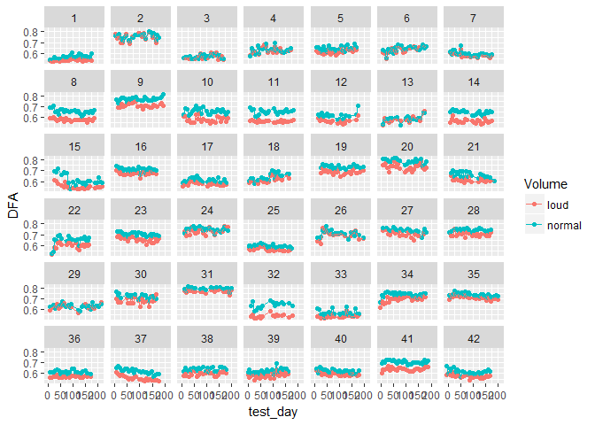

Milestone Report
================
KHemzacek
September 5, 2017

Abstract
--------

This project will create an algorithm that uses signal characteristics of voice recordings to predict Unified Parkinson's Disease Prediction Scale (UPDRS) scores, which are a standard measure of the severity of disability in Parkinson's patients. This could be implemented into the Kinetics Foundation's At Home Testing Device to aid in better disease progression monitoring, especially for remote patients.

Fig 1: The At Home Testing Device (AHTD)

Problem Setup
-------------

The current gold-standard for monitoring the progression of Parkinson's Disease (PD) is the Unified Parkinson's Disease Rating Scale (UPDRS). To get a UPDRS score, a patient will perform a series of tasks and a trained medical rater will assess the degree of disability shown in the patient. This assessment protocol can be problematic for two reasons: 1) The test must be done in person, which limits how often monitoring can be done, especially for rural patients with a long commute into a medical center. 2) The test is subjective, so tests often require longer and depend on clinical opinion.

The Kinetics Foundation, with the help of Intel, developed an At Home Testing Device (AHTD) to test the feasibility of remote monitoring for PD patients. This device guides patients through a series of tasks and records the results, which are then sent via internet to the patient's physician. The AHTD would allow monitoring measurements to be performed much more frequently, detecting changes more quickly. It would also reduce the travel time required of patients, especially rural patients. The measurements taken by this device could also be analyzed quantitatively, making the measurement of PD progression less subjective and potentially automated.

This project will focus on the automated analysis of voice recordings resulting from a speech task that AHTD users were asked to perform. An algorithm will be developed that uses signal characteristics of these voice recordings to predict a UPDRS score. This algorithm could potentially be implemented into the AHTD or other similar devices to better automate all PD monitoring and to increase the feasibility of implementing widespread AHTD usage by reducing the time required of physicians to interpret results.

Original Dataset
----------------

This project uses the Oxford Parkinson's Disease Telemonitoring Dataset, available [here](https://archive.ics.uci.edu/ml/datasets/parkinsons+telemonitoring). The voice recordings were obtained as part of a feasibility study for the AHTD1. A variety of signal processing techniques were then applied to each recording to calculate the signal attributes that are shown in the dataset2. It was donated to the UCI Machine Learning Repository on 2009-10-29 by Athanasios Tsanas and Max Little of the University of Oxford.

The original dataset includes 5875 observations, each observation representing one voice recording. The observations come from 42 early-stage Parkinson's patients. Once per week, each subject was supposed to take six recordings of the same sound (a sustained vowel phonation "ah"), four of the six at normal speaking volume and the other two at a louder volume. Patients performed this testing over approximately six months.

The 22 given attributes include:

-   Subject number
-   Time since trial recruitment
-   2 subject demographics (age, gender)
-   2 UPDRS scores (total, motor)
-   16 signal attributes
    -   5 measures of variation in fundamental frequency (Jitter variables)
    -   6 measures of variation in amplitude (Shimmer variables)
    -   NHR (Noise to Harmonics Ratio) and HNR (Harmonics to Noise Ratio)
    -   3 non-traditional signal characteristics: RPDE (Recurrence Period Density Entropy), DFA (Detrended Fluctuation Analysis), PPE (Pitch Period Entropy)

Dataset Challenges and Limitations
----------------------------------

First, because each of the observations represents one recording and patients took 2 loud and 4 normal-volume recordings each day, the dataset actually includes a lot of replicate observations. Even if the replicates are averaged together, the dataset still contains many observations from the same person across a particular timeline, so the observations are not truly independent of each other. As many analysis methods assume independent observations, this will need to be addressed. After it is, because there are only 42 people, the set of independent observations will actually be relatively small. To address this, analysis may need to be repeated on several randomly selected sets of independent observations and the results averaged together.

The dataset also doesn't include a lot of data aside from the signal attributes and UPDRS scores. The amount of patient data included may need to be limited because of privacy concerns, but it does mean that the signal attributes don't have a lot of clinical context. Also, UPDRS scores are typically based on a person's performance on multiple tasks. An algorithm that can interpret the results of one task is a necessary step, but more data would be required to begin interpreting other tasks and get a better prediction of overall UPDRS.

Lastly, the UPDRS scores in the dataset are actually linear interpolations based on the UPDRS scores at doctors visits at the beginning, middle, and end of the 6 month window during which voice recordings were being taken. This means there is actually some uncertainty in the variable being predicted. It also means that the dataset is limited in the questions it can answer about the progression of the disease.

Initial Data Wrangling
----------------------

Because this dataset had previously been used for analysis, it was relatively clean. The data was checked for missing values and typos and none were found. However, there were several data wrangling steps that had to be taken pior to the large data transformation step of averaging together the replicate observations.

The dataset was not necessarily made to be loaded into R. Several variables were renamed to get rid of special characters and make them more R-friendly. The "sex" variable was also changed so that it would be interpreted by R as a factor (male and female) rather than as an integer (0 and 1).

Entries of the variable "test\_time" were made up of an integer part, which was the number of days since the patient was recruited into the study, and a non-integer part, which referred to when in the day that recording was taken. Because this variable contained two distinct pieces of information, both of which could be useful and interesting on their own, it was broken up into the variables "test\_day" (the integer part), and "time\_of\_day" (the non-integer part). The variable "time\_of\_day" was also multiplied by 24 so that it was a number in hours rather than a portion of a day.

One variable was also conspicuously missing. According to dataset documentation, patients took both loud and normal volume recordings. However, none of the variables indicated volume level. The researchers who made the dataset available were contacted to obtain the values of this variable. The information that they supplied was added to the dataset as a new factor variable "Volume".

Initial Exploratory Analysis
----------------------------

Before the final averaged dataset could be created, two questions needed to be answered: 1) Should normal and loud recordings be treated as distinct from each other? and 2) Will there be days with other than the expected 6 recordings that will cause problems when averaging?

### Investigating Volume Levels

The first question addressed in exploratory data analysis was whether or not the two volume levels should be considered distinct from each other. This was investigated first using unsupervised clustering algorithms and then using plots which separated normal and loud recordings.

#### Clustering

Before attempting to cluster the data, a within-groups-sum-of-squares plot and a dendrogram were used to try to determine the best number of clusters. Neither clearly indicated one best number of groups. Two was chosen as the number of groups, since this seemed most likely to reveal if the data would cluster into the two volume levels. The clustering data was limited to only signal characteristics. Both hierarchical clustering and k-means clustering were applied to the data. Neither method separated the data into groups defined by volume levels or any other single variable (gender, UPDRS, etc). While this seemed to give a preliminary indication that there was not a significant difference between the signals at the two volumes, there could have simply been too many other factors influencing the clustering. It was decided that more directed investigation was needed.

#### Plotting

Two types of plots were used to compare normal and loud signal characteristics: the value of a signal characteristic plotted over time for each patient (with points for each volume level in a different color), and a box plot for a signal characteristic (one box-whisker for each volume level). Examples of each type of plot are shown below. While neither type of plot showed huge differences between the two volume levels, they both showed a trend that "normal" volume recordings were higher in most characteristics than "loud" volume recordings were. The plots shown below show this trend most significantly, but the trend was present for all of the signal characteristics plotted.

Most of the signal characteristics are a measures of variation or inconsistency within the signal. The recordings are of a single sustained vowel sound, so they should be fairly constant. Variation most likely indicates a lack of voice control, which is the disability this task was designed to measure. This seems to suggest that lack of voice control is more evident when a person is speaking normally; speaking loudly may somewhat mask this lack of control.

The same trend was observed consistently enough across patients and variables, it was decided that normal and loud recordings would be treated as distinct from each other and would not be averaged together.

### Recordings per Patient per Day

After deciding to separate recordings by volume level, it was important to investigate the number of recordings taken by a patient on each given day. If more or less than the expected 6 recordings were present, ti could cause issues when averaging the replicate data.

The scatter plot shows the distribution of test days over time for each patient. The number of recordings taken each day is shown in the color of the points. Many patients have gaps where they didn't take any recordings for at least a week. But because this project doesn't seek to investigate the time-series nature of the data, this shouldn't be a problem. This plot also shows that on the vast majority of days where patients took any recordings, they took the expected 6 recordings. However, there are also a fair number of days when patients only took 5 recordings, and a few exceptions where patients took 3, 4, 11, or 12 recordings. The days with other than 6 recordings seem to be randomly spread across time and patients.

The days with 3 or 4 recordingswere investigated to see if both normal and loud recordings were taken. One of the days with 3 was found to be an outlier in the normal/loud signal characteristic time-series plots. On this day, most likely the machine was not working correctly, which explains the outlying data and the fact that the person stopped short of the 6 recordings. This day was removed. Of the seven days with 4 recordings, 2 were found to have no loud recordings. These points were kept, knowing that they can only become partial recordings. Missing data will be addressed later. The rest of these days had at least one loud and one normal recording.

The days with 11 or 12 recordings were investigated to see if these should be treated as two separate sets of recordings or all averaged together. On most of these days, the recordings were all taken without much time between the first set of recordings and the second set, and neither set represented a significant outlier. Most likely the patient took one set of recordings and didn't feel like it went well even if it wasn't actually a significant deviation from normal. One of the days had 11 hours between the first and second set. This was more likely intended as two separate sets of recordings. However, it is difficult to know that this is what was intended. Perhaps 11 hours later was the earliest this person could redo their trial, given their schedule. And while 11 hours is a longer amount of time in between than any of the other days with 11 or 12 recordings, it is not very long in comparison to a week, which is the amount of time that was supposed to be in between sets of recordings. Therefore, it was decided that on all of the days with more than 6 recordings, all recordings could be averaged to make one observation for that day.

Averaging Duplicate Recordings
------------------------------

The data was grouped by person, test day, and volume. All data other than signal characteristics was temporarily removed from the dataset. Within each group, median and IQR were calculated for each of the signal characteristics. This resulted in a dataset where each observation summarised the replicate observations for each volume level, on each day that a person took recordings.

The observations were then separated by volume into different dataframes. The signal features were renamed to reflect the volume level as well as the signal characteristic and type of summary statistic (median/IQR). The normal and loud data was then joined by subject number and test day to make one "wide" dataframe, each observation representing all the data from one person on one day. Demographics, the median time of day, and median UPDRS scores for each observation were then added back in. Two new features: the number of loud recordings and the number of normal recordings that went into each observation. This is the version of the dataset that the main analysis was performed on.

The dataset header is shown below:

|  subject\_num|  age| sex  |  test\_day|  time\_of\_day|  loud\_recs\_count|  normal\_recs\_count|  motor\_UPDRS|  total\_UPDRS|  normal\_Jitter\_Percent\_median|  normal\_Jitter\_Abs\_median|  normal\_Jitter\_RAP\_median|  normal\_Jitter\_PPQ5\_median|  normal\_Jitter\_DDP\_median|  normal\_Shimmer\_median|  normal\_Shimmer\_dB\_median|  normal\_Shimmer\_APQ3\_median|  normal\_Shimmer\_APQ5\_median|  normal\_Shimmer\_APQ11\_median|  normal\_Shimmer\_DDA\_median|  normal\_NHR\_median|  normal\_HNR\_median|  normal\_RPDE\_median|  normal\_DFA\_median|  normal\_PPE\_median|  normal\_Jitter\_Percent\_IQR|  normal\_Jitter\_Abs\_IQR|  normal\_Jitter\_RAP\_IQR|  normal\_Jitter\_PPQ5\_IQR|  normal\_Jitter\_DDP\_IQR|  normal\_Shimmer\_IQR|  normal\_Shimmer\_dB\_IQR|  normal\_Shimmer\_APQ3\_IQR|  normal\_Shimmer\_APQ5\_IQR|  normal\_Shimmer\_APQ11\_IQR|  normal\_Shimmer\_DDA\_IQR|  normal\_NHR\_IQR|  normal\_HNR\_IQR|  normal\_RPDE\_IQR|  normal\_DFA\_IQR|  normal\_PPE\_IQR|  loud\_Jitter\_Percent\_median|  loud\_Jitter\_Abs\_median|  loud\_Jitter\_RAP\_median|  loud\_Jitter\_PPQ5\_median|  loud\_Jitter\_DDP\_median|  loud\_Shimmer\_median|  loud\_Shimmer\_dB\_median|  loud\_Shimmer\_APQ3\_median|  loud\_Shimmer\_APQ5\_median|  loud\_Shimmer\_APQ11\_median|  loud\_Shimmer\_DDA\_median|  loud\_NHR\_median|  loud\_HNR\_median|  loud\_RPDE\_median|  loud\_DFA\_median|  loud\_PPE\_median|  loud\_Jitter\_Percent\_IQR|  loud\_Jitter\_Abs\_IQR|  loud\_Jitter\_RAP\_IQR|  loud\_Jitter\_PPQ5\_IQR|  loud\_Jitter\_DDP\_IQR|  loud\_Shimmer\_IQR|  loud\_Shimmer\_dB\_IQR|  loud\_Shimmer\_APQ3\_IQR|  loud\_Shimmer\_APQ5\_IQR|  loud\_Shimmer\_APQ11\_IQR|  loud\_Shimmer\_DDA\_IQR|  loud\_NHR\_IQR|  loud\_HNR\_IQR|  loud\_RPDE\_IQR|  loud\_DFA\_IQR|  loud\_PPE\_IQR|
|-------------:|----:|:-----|----------:|--------------:|------------------:|--------------------:|-------------:|-------------:|--------------------------------:|----------------------------:|----------------------------:|-----------------------------:|----------------------------:|------------------------:|----------------------------:|------------------------------:|------------------------------:|-------------------------------:|-----------------------------:|--------------------:|--------------------:|---------------------:|--------------------:|--------------------:|-----------------------------:|-------------------------:|-------------------------:|--------------------------:|-------------------------:|---------------------:|-------------------------:|---------------------------:|---------------------------:|----------------------------:|--------------------------:|-----------------:|-----------------:|------------------:|-----------------:|-----------------:|------------------------------:|--------------------------:|--------------------------:|---------------------------:|--------------------------:|----------------------:|--------------------------:|----------------------------:|----------------------------:|-----------------------------:|---------------------------:|------------------:|------------------:|-------------------:|------------------:|------------------:|---------------------------:|-----------------------:|-----------------------:|------------------------:|-----------------------:|-------------------:|-----------------------:|-------------------------:|-------------------------:|--------------------------:|------------------------:|---------------:|---------------:|----------------:|---------------:|---------------:|
|             1|   72| male |          5|        15.4668|                  2|                    4|        28.199|       34.3980|                         0.003805|                     1.81e-05|                     0.001485|                      0.001490|                     0.004460|                 0.012370|                       0.1190|                       0.004830|                       0.005570|                        0.010260|                      0.014495|            0.0117640|              27.2840|              0.415520|             0.541045|             0.165360|                     0.0016000|                  9.50e-06|                 0.0011550|                  0.0007850|                 0.0034725|             0.0050925|                   0.04850|                   0.0039975|                   0.0037975|                    0.0033575|                  0.0119875|         0.0103498|           3.24175|          0.0389675|         0.0128700|         0.0472315|                       0.002720|                   1.37e-05|                   0.001155|                    0.001075|                   0.003465|               0.008445|                     0.0780|                     0.003405|                     0.003770|                      0.007335|                    0.010210|          0.0093705|            29.8160|            0.360195|           0.531695|          0.1161435|                    0.000220|                 9.0e-07|                0.000055|                 0.000175|                0.000155|            0.002135|                  0.0200|                  0.001185|                  0.001180|                   0.001545|                 0.003560|       0.0055485|          2.2860|         0.049665|        0.004025|       0.0502065|
|             1|   72| male |         12|        16.0320|                  2|                    4|        28.447|       34.8940|                         0.004095|                     2.14e-05|                     0.001500|                      0.001765|                     0.004495|                 0.018235|                       0.1885|                       0.007865|                       0.009230|                        0.016180|                      0.023590|            0.0217605|              25.4770|              0.448800|             0.544160|             0.183115|                     0.0032850|                  1.77e-05|                 0.0011350|                  0.0012925|                 0.0034100|             0.0094950|                   0.10000|                   0.0070025|                   0.0060700|                    0.0041600|                  0.0210125|         0.0270032|           4.91475|          0.0637075|         0.0221450|         0.1525025|                       0.004970|                   2.39e-05|                   0.002160|                    0.002015|                   0.006485|               0.015970|                     0.1695|                     0.007755|                     0.008510|                      0.011625|                    0.023275|          0.0230675|            26.9775|            0.415630|           0.525360|          0.2080900|                    0.001860|                 8.0e-06|                0.001050|                 0.000625|                0.003145|            0.008470|                  0.0965|                  0.004545|                  0.004500|                   0.004455|                 0.013635|       0.0092385|          0.9665|         0.066940|        0.004220|       0.0135100|
|             1|   72| male |         19|        16.3920|                  2|                    4|        28.695|       35.3890|                         0.004645|                     2.44e-05|                     0.002040|                      0.002025|                     0.006120|                 0.020575|                       0.2075|                       0.009850|                       0.011070|                        0.016020|                      0.029550|            0.0235270|              23.7460|              0.503640|             0.545520|             0.221620|                     0.0006575|                  2.40e-06|                 0.0002150|                  0.0002075|                 0.0006650|             0.0086300|                   0.06100|                   0.0054075|                   0.0060375|                    0.0063200|                  0.0162275|         0.0024473|           1.43125|          0.0435450|         0.0038975|         0.0274525|                       0.003745|                   1.86e-05|                   0.001370|                    0.001760|                   0.004110|               0.010410|                     0.1320|                     0.003020|                     0.004020|                      0.009145|                    0.009070|          0.0263495|            29.1950|            0.384925|           0.522330|          0.1584915|                    0.001015|                 4.5e-06|                0.000630|                 0.000800|                0.001900|            0.002110|                  0.0360|                  0.000810|                  0.001090|                   0.002335|                 0.002430|       0.0152305|          1.4670|         0.040955|        0.001010|       0.0905785|
|             1|   72| male |         25|        15.5640|                  2|                    4|        28.905|       35.8105|                         0.003445|                     2.10e-05|                     0.001525|                      0.001500|                     0.004565|                 0.012015|                       0.1235|                       0.005980|                       0.006405|                        0.008470|                      0.017930|            0.0219215|              27.1370|              0.440435|             0.565270|             0.126545|                     0.0006900|                  3.50e-06|                 0.0005625|                  0.0004975|                 0.0016850|             0.0073500|                   0.11125|                   0.0035150|                   0.0038750|                    0.0044175|                  0.0105450|         0.0124328|           2.71975|          0.0468550|         0.0136050|         0.0675250|                       0.002805|                   1.35e-05|                   0.001065|                    0.001000|                   0.003190|               0.007555|                     0.0700|                     0.003275|                     0.003880|                      0.006665|                    0.009815|          0.0055905|            30.8760|            0.380265|           0.529960|          0.1685500|                    0.001025|                 4.8e-06|                0.000235|                 0.000020|                0.000710|            0.001005|                  0.0130|                  0.000325|                  0.000290|                   0.000285|                 0.000975|       0.0044235|          0.2520|         0.056415|        0.002040|       0.0518000|
|             1|   72| male |         33|        15.4680|                  2|                    4|        29.187|       36.3750|                         0.003485|                     1.93e-05|                     0.001315|                      0.001530|                     0.003945|                 0.016110|                       0.1580|                       0.006530|                       0.008520|                        0.016240|                      0.019580|            0.0131220|              26.1810|              0.493170|             0.551330|             0.191260|                     0.0008475|                  5.60e-06|                 0.0005275|                  0.0005525|                 0.0015675|             0.0083775|                   0.09000|                   0.0044825|                   0.0052150|                    0.0080525|                  0.0134475|         0.0048392|           1.35075|          0.0205125|         0.0093025|         0.0208825|                       0.003320|                   1.68e-05|                   0.001290|                    0.001440|                   0.003865|               0.014220|                     0.1780|                     0.006600|                     0.007315|                      0.012105|                    0.019795|          0.0167115|            26.5150|            0.383560|           0.531460|          0.2467850|                    0.000640|                 4.3e-06|                0.000320|                 0.000260|                0.000965|            0.002330|                  0.0240|                  0.001170|                  0.001285|                   0.001965|                 0.003505|       0.0052505|          1.6980|         0.025180|        0.006140|       0.0082550|
|             1|   72| male |         40|        15.6840|                  2|                    4|        29.435|       36.8700|                         0.004175|                     2.56e-05|                     0.001490|                      0.001525|                     0.004470|                 0.022025|                       0.2100|                       0.009670|                       0.012170|                        0.017325|                      0.029015|            0.0172305|              25.7345|              0.496695|             0.550830|             0.211915|                     0.0012400|                  7.00e-06|                 0.0003625|                  0.0002975|                 0.0011000|             0.0023125|                   0.02500|                   0.0011825|                   0.0022050|                    0.0024800|                  0.0035600|         0.0078612|           1.77850|          0.0277100|         0.0102475|         0.0457650|                       0.002940|                   1.46e-05|                   0.001210|                    0.001360|                   0.003635|               0.014395|                     0.1355|                     0.006915|                     0.007780|                      0.012525|                    0.020750|          0.0046850|            26.3735|            0.392950|           0.535790|          0.1643400|                    0.000410|                 2.8e-06|                0.000300|                 0.000230|                0.000905|            0.004845|                  0.0395|                  0.002855|                  0.003050|                   0.004485|                 0.008560|       0.0008070|          1.2875|         0.036670|        0.010080|       0.0097500|

### Missing Data

Though there were no missing values in the original dataset, averaging the replicate data lead to missing data on any days with less than 2 loud recordings.

For days with no loud recordings, no value could be calculated for any of the loud signal characteristics. These were automatically filled in as NA when the loud and normal dataframes were joined during the creation of the averaged dataset.

For days with only one loud recording, a reasonable median could be calculated for signal characteristics of loud recordings (the one value from the one loud recording became the median value). While it is likely not the best descriptor of central tendency, it is reasonable to assume that the one sample collected is near to the value that variable was most likely to take on. However, IQR cannot reasonably be calculated. IQR is a measure of variability. By default, the IQR() function returns 0 when it is run on a vector of length one. However, if only one recording is present, nothing is known about the variability for that observation. It is not reasonable to assume low variability or to assume high variability because there is nothing about a single observed value to indicate how far away a second recording is expectetd to be. Therefore, IQR was set to NA for all observations where loud\_recs\_count was less than 2.

There were no observations with less than 2 normal-volume recordings.

A total of 25 observations had missing values. Two were missing all loud data and the other 23 were missing only loud IQR data. All missing values were coded as NA and the partial observations were kept. The exploratory data techniques can work around missing data as long as it is coded as NA. Since only a subset of variables will be used for linear regression, the missing data may not affect the linear regression algorithm either. If the missing data does become an issue, the MICE algorithm will likely be used to impute the missing values.

Continuing Data Exploration
===========================

After the final averaged dataset was created, the data could be explored in more depth.

time\_of\_day Variable
----------------------

Before further exploration was done, the time\_of\_day variable was investigated to determine if it was a broadly meaningful variable (corresponded to a time of day consistently for all patients) or if it only served to order the recordings taken within a day. The time\_of\_day feature was calculated from the given variable test\_time. The documentation indicated that the integer part of test\_time was the number of days since trial recruitment. The non-integer part of test\_time was not specifically addressed, though it presumably corresponded to the time of day: the hours/minutes/seconds that had passed since the last whole day from trial recruitment. However, it was unclear whether each whole day started at midnight or wether it started at the exact time of day when the patient officially started the trial.

To answer this question, a histogram of the time\_of\_day variable was created. If the variable was meaningful, a peak in the morning (before people left for their daily activities), a peak in the evening (after people had finished their daily activities), and possibly a peak around lunchtime break were expected, along with a significant lack of data from times in the middle of the night when people were likely sleeping. If the variable did not consistently refer to same times of the day, a more uniform distribution was expected. The histogram is shown below.

The histogram shows no data 0-4 (midnight - 4am) and very little data 4-6 (4am - 6am) or 23-24 (11pm - midnight). There is a peak 8-9 (8am - 9am) and 18-20 (6pm - 8pm) with less (but not no) data taken between these peaks. Since these peaks correspond to times of day when most recordings are expected and the valleys correspond to times of day when less recordings are expected, it was concluded that the time\_of\_day variable is most likely a meaningful indicator of the time of day.

Patient Data
------------

A dataset of given and calculated characteristics of each patient was created. It included age, gender, length of time in the study, recordings taken, average time between sets of recordings, typical time of day that recordings were taken and the variation in this, starting and ending UPDRS scores, and a calculated feature "progression" which was the overall change in UPDRS divided by the amount of time over which this change took place. While many of these variables did not correlate meaningfully, this exploration did lead to several interesting findings.

First, it was found that the distribution of the time of day that recordings were taken had a different shape for men and women.

The female participants primarily took recordings in the morning and less female participants typically took recordings later in the day. Male participants have two distinct peaks:one in the morning and one in the evening. They are less likely than female participants to have typically taken recordings in the afternoon.

Also, with increasing age, participants had on average less days between tests and less variability in the time of day when they took their recordings. As the older patients in the study are very likely retired, these correlations may be due to participants having less other commitments to work around when scheduling/performing the trials.

Perhaps the most interesting correlation observed was the negative correlation between starting UPDRS and UPDRS progression. The correlation coefficient of the first day motor UPDRS and motor UPDRS progression is -0.2478741 and the correlation coefficient for total UPDRS is -0.2226871. Plotting first day UPDRS vs. UPDRS shows that a negative linear correlation is a fairly good description of the relationship between the two variables.

This relationship suggests that UPDRS progression over time may be logarithmic: there is significant increase in experienced disability at first, which continues to increase but at a slower and slower rate. Without more observed data (rather than interpolated UPDRS scores), it is difficult to say if this is truly the case, but this may be a topic worth exploring at another time.

As far as this dataset, it does throw into question the use of linear interpolation to project UPDRS scores between doctors visits. But just looking at the UPDRS scores plotted over time also brings into question the choice to use linear interpolation for UPDRS scores. These plots are shown below.

Outcome Variable Distribution
-----------------------------

The distribution of UPDRS was investigated to determine if it was normally distributed.

To examine the distribution, a set of independent observations (one random observation from each person) was selected. A Q-Q plot was created for motor UPDRS and total UPDRS for each of 3 selections of independent observations. Each normal Q-Q plot showed a similar trend - the tails are somewhat light, but overall, the data is normally distributed. The light tails actually seem to make sense in the context of the data: UPDRS can't go below 0 making a light tail on the low end, and the trial limited participants to early stage PD patients making a light tail on the high end. Aside from these restrictions, the data distribution is reasonably normal, which means that statistical tests and algorithms which assume normal distribution in the outcome variable can be used on this data.

Variable Correlations
---------------------

Finally, the correlations between variables was investigated. Aside from general interest, this step was intended to inform the selection of variables for a linear regression algorithm.

### Correlation with motor\_UPDRS

Correlation coefficients were calculated within sets of independent observations (one random observation from each person). One hundred different sets of independent observations were randomly selected and the correlation coefficients were calculated for each set. The correlation matrices were stored in a list. A vector of the correlation coefficients that describe the correlation of motor\_UPDRS with each of the other variables was taken from each of the 100 correlation matrices, and these vectors were accumulated into a single dataframe with 100 observations for each variable correlation coefficient. From this dataframe, a box-and-whisker plot was created that showed summary statistics of the correlation coefficients for each variable.

From this box-and-whiskers plot, seven features that seemed to correlate most significantly with motor\_UPDRS were selected. The features selected had a median coefficient whose absolute value was 0.2 or greater (or at least close to this), a relatively small IQR, and a range that didn't cross 0. All of the features not selected had ranges that crossed 0 (features that weren't sure if they are positively or negatively correlated with the outcome variable).

The features selected included age and six signal characteristics. The rest of the features were medians, half of them coming from loud recordings and the other half coming from normal-volume recordings. HNR and PPE contributed two signal characteristics (the median of these variables for both loud and normal recordings). Three of the features were non-traditional signal characteristics. Most were positively correlated with motor UPDRS, but the two HNR features were negatively correlated with motor UPDRS.

Twelve other features were identified as having a fair correlation with motor UPDRS. They included time\_of\_day and 11 signal characteristics. Again, the characteristics were all medians and a good split of normal and loud features. Most were positively correlated with motor UPDRS, but time\_of\_day and normal\_DFA\_median were negatively correlated.

It was observed that the correlation coefficients were overall higher when calculated on a subset of independent observations rather than being calculated from all of the observations.

While time\_of\_day seems to have a fairly strong correlation with UPDRS, the argument could be made that time\_of\_day should not be used as a predictive variable for UPDRS. The variable time\_of\_day was calculated from test\_time, which was used to interpolate UPDRS values. However, since UPDRS generally increases over time, a positive correlation would be expected. There is a negative correlation between time\_of\_day and motor\_UPDRS. Also, time\_of\_day only makes up a very small portion of the variation in test\_time. It was the non-integer part of test\_time that became time\_of\_day. The non-integer part ranged 0-1 whereas all of test\_time ranged 0-216.

### Correlation Between Top Candidates

After features were selected that had the strongest correlation with motor\_UPDRS, the correlation between these variables was investigated.

From each item in the list of correlation matrices, a smaller correlation matrix was selected which contained the coefficients that described the correlation between the top feature candidates, and these smaller matrices were stored in a list. From each item in this list, the correlation coefficients relating to a single feature were pulled and aggregated into a dataframe of 100 observations of the correlation coefficient with each of the other candidate features. This was repeated for each candidate feature and the dataframes were stored in a list. From these dataframes, box-and-whisker plots were created to visually inspect the correlation between the candidate features.

Between candidate features, a low correlation coefficient is desired. For each of the candidate features, there are at least two other features which have a high correlation with the outcome variable and a low correlation with each other. Each of these sets of variables could make a good selection of predictive variables for a linear regression model. The next step will be implementing a linear regression machine learning algorithm to see if a strong predictive model can be created.

Analysis Approach
-----------------

Machine learning will be used to create a model to predict motor UPDRS scores. As the outcome variable is continuous and at least some of the features seem to have a strong enough linear correlation with the outcome variable, linear regression will be used.

The data will first be split into train and test sets. Because the observations are not independent of each other, a simple random split with cannot be used. Instead, a random 4 of 42 patients are fully allocated to the test set and a random 20% of observations from each of the rest of the patients is also allocated to the test set. This results in just over 70% of all observations being allocated to the train set. This type of split ensures two things: 1) a good representation of different subjects in both training and testing sets to prevent overfitting to a few patients, and 2) that the testing set contained some patients that were not present in the training set to demonstrate the model's efficacy on unseen patients.

A linear regression model will then be built to predict motor UPDRS scores. The dataset features will be explored to find sets of features that are strongly correlated with UPDRS and weakly correlated with each other. These sets can each be used to create a model and the efficacy of each of these models can be compared to find the best model.

Because the observations are not independent of each other, the linear regression algorithm should not be run on all observations together. Instead, a set of independent observations will be selected with one random observation from each person. A linear regression model will be trained using this set and the output of this model will be saved. This will be repeated many times and the coefficient values will be averaged to create a single model. This model can then be tested on the test dataset to determine its efficacy on new data.

This best model will also be compared to a model that was trained with a set of observations that are not independent from each other. The model may also be compared with a Regression Tree model (CART for continuous variables), to see if the data is better described by a model that is not linear in nature.

References
----------

1.  Goetz, C.G. et al. Testing objective measures of motor impairment in early Parkinson's disease: Feasibility study of an at-home testing device. Movement Disorders (December 11, 2008) doi. 10.1002/mds.22379

2.  Athanasios Tsanas, Max A. Little, Patrick E. McSharry, Lorraine O. Ramig (2009), 'Accurate telemonitoring of Parkinson's disease progression by non-invasive speech tests', IEEE Transactions on Biomedical Engineering.
