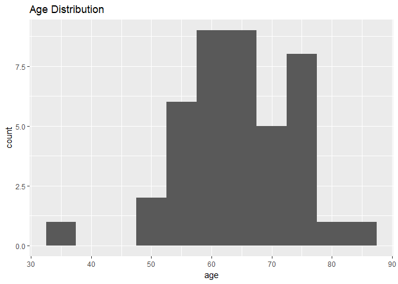
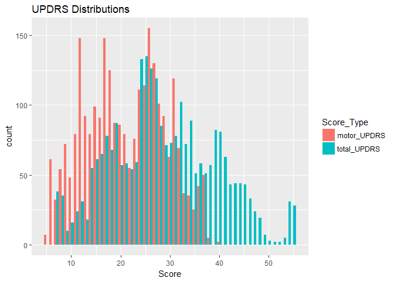
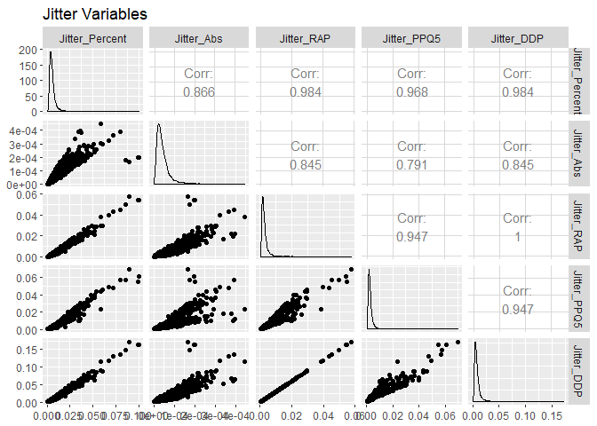
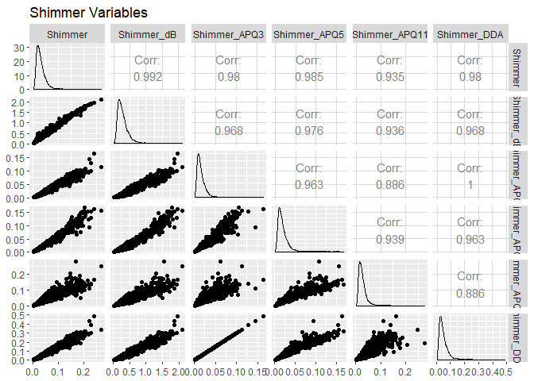
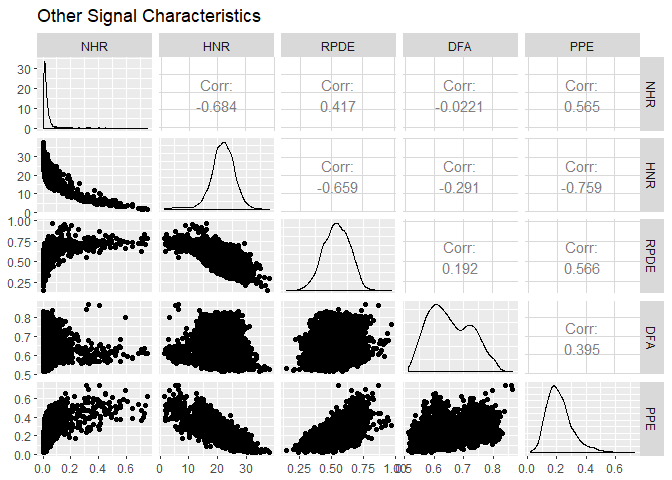
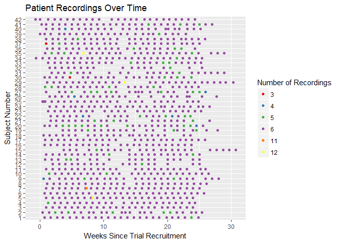

Data Wrangling Summary
================
KHemzacek
August 6, 2017

Renaming and Changing Variable Type
-----------------------------------

When the data was first read into R, names contianing special characters did not read into R correctly. The first data wrangling step was renaming these variables to have more R-friendly names.

The next step was changing the variable "sex" to a factor variable, rather than a binary integer variable and renaming the levels "male" and "female" to make the data more clear and interpretable.

Creating New Variables
----------------------

The variable "test\_time" contained values that were not integers. According to dataset documentation, the integer part of "test\_time" represented the number of days since trial recruitment. The non-integer part must have correlated to the time of day, but may not have referred to the time of day consistently between patients. Two new variables were derived from this variable: "test\_day" and "time\_of\_day" which represented the information in "test\_time" in a more accessible way.

One variable was also conspicuously missing. According to dataset documentation, patients took both loud and normal volume recordings. However, none of the variables indicated volume level. The researchers who made the dataset available were contacted to obtain the values of this variable. The information that they supplied was added to the dataset as a new factor variable "Volume".

Checking for Typos and Missing Data
-----------------------------------

Several methods were also used to check for typos and missing data.

A summary of the dataframe was consulted. This showed that no NAs were present and the data values in summary were mostly not surprising.

The fact that the observations were not all independent was leveraged to cross-reference demographics data within each subject to check for typos. The demographics data was found to be consistent and all 42 subjects were found to be present.

Finally, the variables were histogrammed to see the distribution of the data. The histograms were informative and some surprising distribution shapes were observed as well as very high correlation between some of the signal characteristics. However, no significant outliers or unexpected spikes were found in the histograms. This indicated that the data likely represented the reality of the study and did not contain significant outliers.

Missing Observations
--------------------

The dataset dimensions showed that there were less recordings present than expected. To investigate why, the number of observations per patient per day was examined. It was found that recordings were missing both because patients sometimes took less than the expected 6 recordings per day and because patients sometimes skipped days when they should have taken recordings.

When the observations are treated as independent, these missing observations will not be noticed as missing data. However, duplicate recordings are averaged, missing observations will need to be addressed as missing data. Further exploratory analysis will better inform how this missing data should be handled. But most likely, data from each patient each day will be averaged together regardless of the number of recordings from that day. Weeks where testing was skipped all together will likely be left as missing data points, since the time-series of the data is not terribly significant for associating UPDRS scores with signal characteristics.

Splitting Testing and Training Sets
-----------------------------------

Because the observations were not independent of each other, a simple random split could not be used to create testing and training sets. Instead, a function was written that selects subjects, according to a given ratio, to be fully allocated to the test set and divides the observations within each of the remaining subjects into the train and test sets according to another given ratio. This type of split ensured two things: 1) a good representation of different subjects in both training and testing sets to prevent overfitting to a few patients, and 2) that the testing set contained some patients that were not present in the training set to demonstrate the model's efficacy on unseen patients.

Averaging Duplicate Observations
--------------------------------

For some of the analysis, recordings taken from the same patient on the same day will need to be averaged. However, this will require a fair amount of data exploration to deterine, for example, if recordings taken at normal volume can be averaged with loud recordings, if all recordings can be averaged together on days with more recordings than expected, and if days with less than 6 recordings can still be considered valid data points.

When these questions are addressed, the averaged dataset will likely be composed of observations, each of which summarise one day of testing for one patient. Both the mean and standard deviation will be calculated for each signal characteristic, doubling the number of variables in each observation.

The data may also be grouped by volume so that one set of variables describes the normal-volume recordings and a parallel set of variables describes the loud recordings. This would again double the number of variables in the dataset. There may also be some cleaning to do for factor variables like "sex" that can't be averaged, or new variables that are meaningless like "age\_sd" (because age should not vary at all within-subject and within-day). This data wrangling step will be revisited after some exploratory data analysis.
